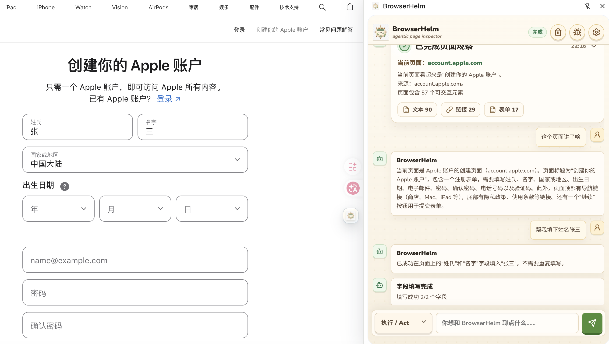

<p align="center">
  
</p>

<h1 align="center">BrowserHelm</h1>
<h3 align="center">A Local-First Browser AI Agent</h3>

<p align="center">
  <a href="https://browser-helm.counterxing.top"><strong>🌐 browser-helm.counterxing.top</strong></a> &nbsp;·&nbsp;
  <a href="#-quick-start"><strong>🚀 Quick Start</strong></a> &nbsp;·&nbsp;
  <a href="docs/"><strong>📖 Docs</strong></a>
</p>

<p align="center">
  <strong>🇺🇸 English</strong> &nbsp;|&nbsp;
  <a href="README.md">🇨🇳 中文</a>
</p>

<p align="center">
  
  
  
  
  
  
  
  
</p>

> **Understand the page first, then act safely.** BrowserHelm is an AI page assistant that runs directly in your browser. No BrowserHelm backend or account required. When using a cloud AI provider, trimmed/redacted page context is sent to your configured provider endpoint — BrowserHelm itself does not collect or store your data.

> **Release status:** v1.6 is managed as a controlled beta / release candidate. Domain Adapters are non-executing hints; real-model / real-site E2E remains opt-in evidence for each release; `debugger` and `downloads` are required by current core extension features, while CDP attach still requires BrowserHelm approval.

---

## ✨ Why BrowserHelm?

| | BrowserHelm | Other Browser Agents |
|---|---|---|
| 🔒 **Privacy** | 100% local, zero third-party sharing | Usually requires cloud relay |
| 🧠 **Model Freedom** | BYOK — use your own API key | Typically locked to specific models |
| 👁️ **Observe-First** | Enforced observe → approve → execute | Acts directly, lacks transparency |
| 📋 **Traceable** | Every step in structured traces | Black-box operations |
| 🎨 **Open Source** | MIT licensed, fully transparent | Mostly proprietary |
| 🔌 **Zero Backend** | No server, no sign-up required | Most depend on cloud backends |

---

## 🧩 Capabilities

### 🔍 Page Understanding

Automatically observe any web page and generate structured page data — title, origin, form fields, interactive elements, accessibility snapshots, iframe relationships. Supports long-page scrolling reads and iframe content penetration. Understand page health at a glance without opening DevTools.

### 🩺 Form Doctor

Complete form diagnosis + assisted fill pipeline:

- **Diagnose**: Auto-identify missing required fields, validation errors, and root causes of disabled submit buttons
- **Infer**: Auto-infer fill plans from user intent and field snapshots (with source, confidence, masked preview)
- **Execute**: Single or batch field filling with full input/change/blur event triggering
- **Verify**: Post-fill HTML5 validity check, required fields, visible error text
- **Submit**: High-risk submission requires explicit approval panel confirmation

### 🖱️ Interactive Element Operations

Read any element's state (visible, disabled, checked, selected), and check action readiness (target validation, risk assessment, approval prediction). The current public tool surface does not expose generic element click/type actions or mutating iframe actions.

### 🛡️ Safe Approval

High-risk actions (submit, delete, execute JS) are blocked by default. The approval panel clearly shows action preview, risk level, and reasoning — you decide to execute or deny. PolicyEngine spans all tool execution paths and cannot be bypassed.

### 🧠 Agent Intelligence

Custom Agent Kernel drives the complete loop:

> Page Observe → Context Compaction → Tool Selection → Risk Approval → Execution → Result Verification → Trace Recording

- **TaskClassifier** auto-classifies user task types
- **ToolSelector** filters tools by run mode and permissions
- **ContextCompactor** trims full page data into model-friendly summaries
- **RecoveryPolicy** handles tool failures and exception recovery
- Supports Ask (read-only diagnosis) and Act (safe execution) dual modes

### 📊 Traceable & Debuggable

- Message waterfall shows the full agent thought → decision → execution → result pipeline
- Structured traces record every decision, tool call, parameter, and result
- Advanced developer panel provides complete trace replay and diagnostic reports
- Streaming model output visible in real time
- Debug mode supports `bh_debug_collect_page_health` to capture Console Errors / Network Failures (requires Debug run mode)
- Page Health Hook is Debug-mode opt-in; it does not collect cookies, password fields, user input, localStorage, or sessionStorage.

### 🔌 Model Freedom

No built-in model service. Compatible with all OpenAI-compatible APIs including Ollama, vLLM, DeepSeek, Qwen, and more — local or cloud. Custom Base URL is supported; API keys are stored in trusted local extension storage (`chrome.storage.local`) by default and can be switched to current-session-only `chrome.storage.session` in settings.

### 🏠 Local-First

Agent core loop, trace, messages, and provider settings run locally via `chrome.storage.local`; API keys use trusted local storage by default and can be switched to `chrome.storage.session`; domain memory, workflows, and scratchpad data use IndexedDB. Zero BrowserHelm backend dependency, no account registration needed. Page context is sent only to your chosen AI provider endpoint.

### 📦 Page Capture & Export

Right-click on any selected text or page area for instant AI understanding and content export. BrowserHelm menu items are flat in the context menu; export actions download directly and do not copy to the clipboard:

- **🔍 Explain Selection**: Select text, right-click "解释选中文字", and the Agent analyzes it in ask mode, opening the side panel to stream a Chinese explanation.
- **🌐 Translate Selection**: Select text, right-click "翻译选中文字", and the Agent translates it in ask mode, streaming the Chinese translation in the side panel.
- **📸 Screenshots / Full-Page Screenshots**: Right-click "截取当前视口" or "截取当前页面长图" to download a PNG directly. Full-page capture auto-scrolls the page, triggers lazy-loaded content, and stitches a complete screenshot. Agents can also call `bh_vision_capture_full_page`, and `bh_vision_batch_capture_full_pages` supports batch capture across current-window pages.
- **📝 Selection to Markdown**: Select text on any page, right-click "下载选区为 Markdown", and a hand-crafted DOM→Markdown converter (no turndown or third-party libraries) turns rich text into structured Markdown with headings, links, lists, tables, and code blocks. Downloads as `browserhelm-selection-YYYY-MM-DD.md`.
- **🖼️ Page Image Collection**: Right-click "获取当前页面全部图片" or call `bh_vision_collect_images` to auto-scroll for lazy-loaded resources and collect images from ``, `<picture>`, `<source>`, `background-image`, `og:image`, and more. Deduplicated results are packaged into `browserhelm-page-images.zip` with a `manifest.json` metadata file. ZIP creation is hand-rolled with zero external dependencies.

---

## 🛠️ Built-in Tools

BrowserHelm ships with **90+ `bh_`-prefixed tools** covering page observation, form diagnosis, element reading, read-only iframe access, accessibility snapshots, DevTools/CDP, vision inspection, advanced browser state inspection, local memory/workflow, and site adapters. Tools are organized by domain:

| Module | Tools | Description |
|---|---|---|
| 🧠 Agent | `bh_agent_finish` `bh_agent_fail` `bh_agent_ask_user` | Run-level state control |
| 📄 Page | `bh_page_observe` `bh_frame_list` | Page observation, frame discovery |
| ♿ A11y | `bh_a11y_snapshot` `bh_a11y_find_interactive` `bh_a11y_refresh_refs` `bh_a11y_resolve_ref` | Accessibility snapshots, ref mapping |
| 🖱️ Element | `bh_element_inspect` `bh_element_read_state` `bh_action_check_readiness` | Element inspection, action readiness |
| 📝 Form | `bh_form_list` `bh_form_inspect` `bh_form_read_fields` `bh_form_find_missing_required` `bh_form_find_validation_errors` `bh_form_find_disabled_submit_reason` `bh_form_infer_fill_plan` `bh_form_fill_field` `bh_form_fill_many` `bh_form_verify` `bh_form_submit_with_approval` | Complete form diagnosis, fill, verify, approve pipeline |
| 🖼️ iframe | `bh_iframe_read` | iframe content reading (mutating actions not exposed in v1.1.2) |
| 🔧 Debug | `bh_debug_collect_page_health` `bh_cdp_attach` `bh_cdp_get_network_events` `bh_cdp_get_console_events` | Page health diagnostics and CDP deep inspect |
| 👁️ Vision | `bh_vision_capture_viewport` `bh_vision_capture_full_page` `bh_vision_batch_capture_full_pages` `bh_vision_collect_images` `bh_vision_describe_viewport` `bh_vision_detect_overlay` `bh_vision_detect_layout_issues` `bh_pointer_click` | Viewport/full-page screenshots, batch capture, page image collection, vision description, overlay/layout issue detection, and last-resort coordinate click |
| 🗂️ Advanced browser | `bh_tab_list` `bh_tab_get_active` `bh_tab_focus` `bh_shadow_list` `bh_shadow_query` `bh_storage_list` `bh_storage_get` `bh_storage_set_with_approval` `bh_storage_delete_with_approval` `bh_storage_clear_with_approval` `bh_download_list` `bh_doc_read_url` | Multi-tab context, Shadow DOM, read-only and approval-gated Web Storage operations, download metadata, and document/PDF reading |
| 🧩 Memory/Workflow | `bh_memory_lookup` `bh_pad_append` `bh_flow_preview` `bh_flow_run_with_approval` | Local domain memory, scratchpad, and workflow replay |
| 🧭 Site Adapter | `bh_adapter_detect_site` `bh_adapter_list_workflows` `bh_adapter_apply_locator` `bh_adapter_report_failure` | Site guidance, workflow/locator hints, failure reports, and generic tool fallback |

See [src/tools/README.md](src/tools/README.md) for details.

---

<p align="center">
  
</p>

## 🚀 Quick Start

### Installation

```bash
git clone https://github.com/xingbofeng/browser-helm.git
cd browser-helm
npm install
npm run build
```

In Chrome:

1. Open `chrome://extensions`, enable "Developer mode"
2. Click "Load unpacked"
3. Select the `.output/chrome-mv3` directory

### Configure Your Model

BrowserHelm does not ship with any model. Bring your own API key:

1. Click the gear icon in the side panel → Model Settings
2. Enter your OpenAI-compatible API details (custom Base URL supported)
3. Test connection → start using

> Compatible with Ollama, vLLM, DeepSeek, Qwen, and all OpenAI-compatible APIs.

### Usage

1. Open any web page → click the BrowserHelm icon in Chrome toolbar
2. Choose "Ask mode" (read-only diagnosis) or "Act mode" (safe execution)
3. Describe your task — the agent will observe the page and start working

---

## 🛠️ Tech Stack

| Layer | Technology |
|---|---|
| Extension Framework | [WXT](https://wxt.dev/) |
| Frontend | React + [Animal Island UI](https://github.com/guokaigdg/animal-island-ui) |
| Language | TypeScript (strict) |
| Validation | Zod |
| Local Storage | chrome.storage.local + chrome.storage.session + IndexedDB (Dexie) |
| State Management | Zustand |
| Model Layer | Custom OpenAI-compatible REST client |
| Testing | Vitest + Playwright |

---

## 🧑‍💻 Development

```bash
npm run dev          # Start dev mode
npm run typecheck    # TypeScript type check
npm run lint         # ESLint
npm test             # Unit/integration tests
npm run test:e2e     # E2E tests
npm run debug:extension:watch  # Extension debug with auto-rebuild + restart
```

See [AGENTS.md](AGENTS.md) for project conventions.

---

## 🤝 Contributing

Issues and PRs are welcome! Please read [AGENTS.md](AGENTS.md) for project structure and development guidelines.

---

## 📄 License

[MIT License](LICENSE)

---

<p align="center">
  <sub>Made with ❤️ for people who build on the web</sub>
</p>
