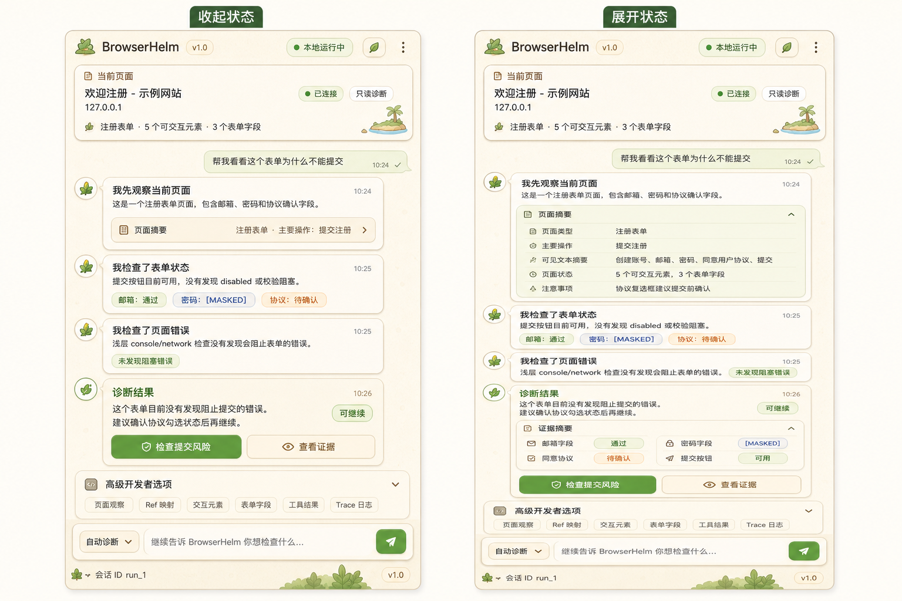
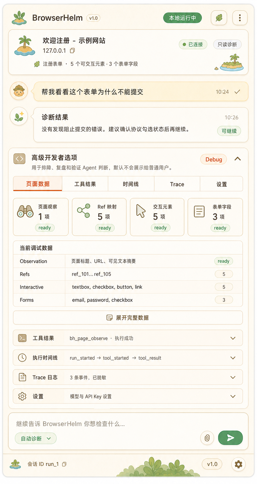
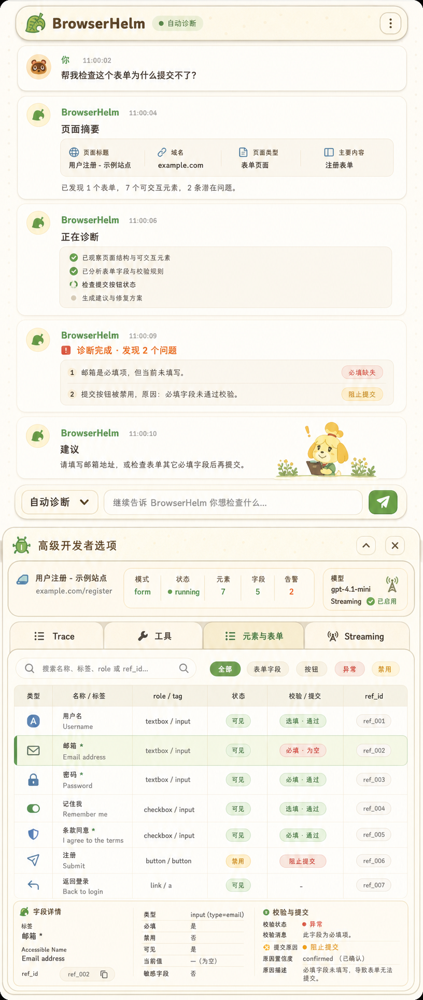
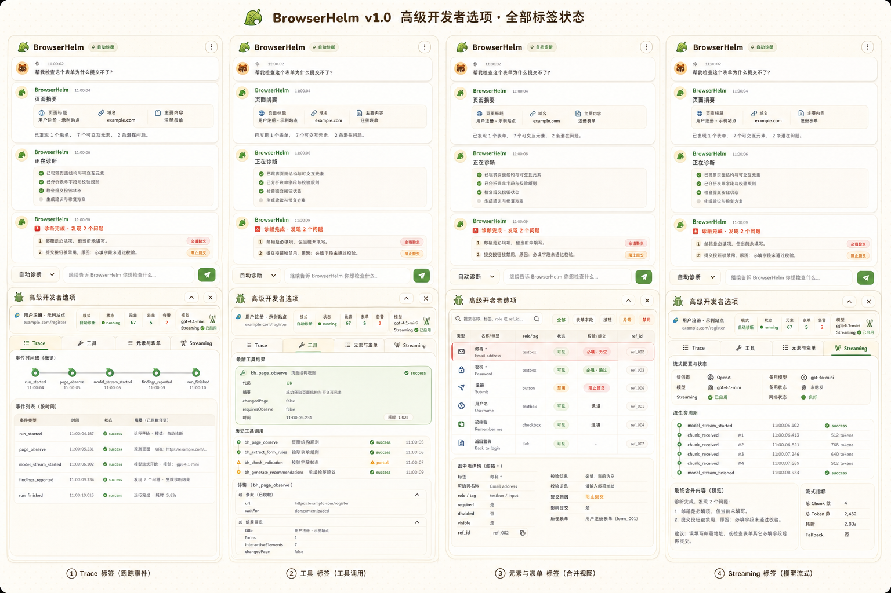
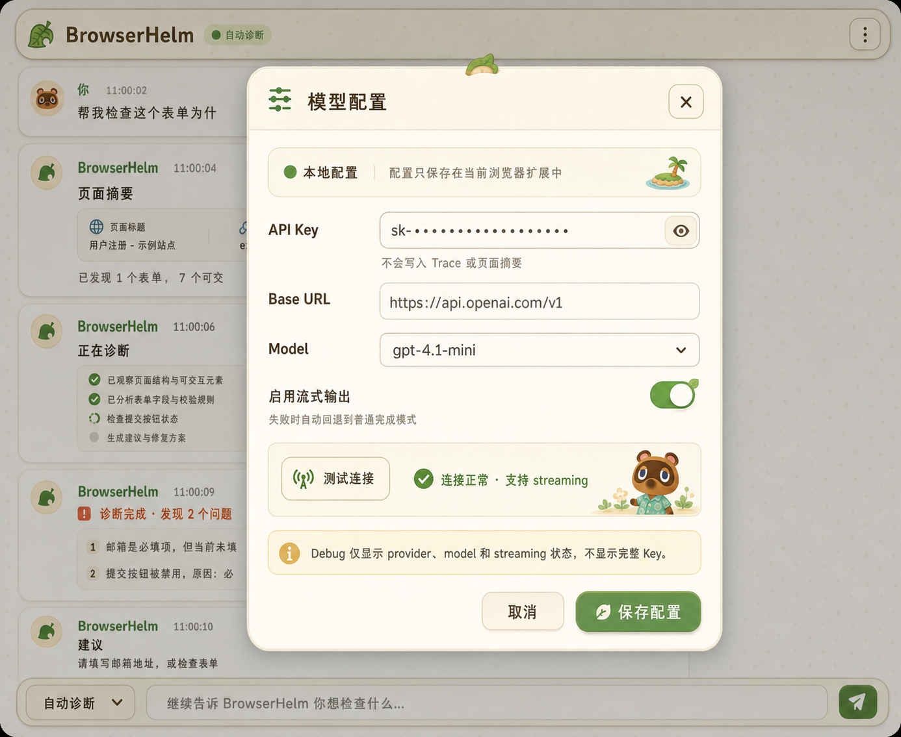

# BrowserHelm v1.0.1 Agent 聊天瀑布流设计稿

本目录保存 BrowserHelm v1.0.1 side panel 的目标 UI 方向：从四个数据 Tab 收敛为 Agent 聊天瀑布流。默认体验以用户任务、页面摘要、Agent 检查步骤、诊断结果和下一步操作为主；原始页面数据、工具结果、Trace 和 Streaming 细节降级到“高级开发者选项”。

## 设计稿

## 关键约定

- 产品名只显示为 **BrowserHelm**。
- 默认不显示四个一级 Tab。
- 页面摘要保留在顶部当前页面卡，以及 Agent 第一条“观察当前页面”的可展开卡里。
- 证据摘要作为 Agent 诊断结果的支撑信息出现，不直接暴露 `ref_id`、raw JSON 或 Trace。
- “高级开发者选项”默认折叠，展开后只保留排障最小集：Trace、工具、元素与表单、Streaming。
- Ref 映射、交互元素和表单字段合并为“元素与表单”一张可筛选表，不再拆成多个 Debug Tab。
- 诊断概览进入默认 Agent 瀑布流，不作为 Debug 主入口。
- Provider 设置放在右上角三个点打开的“模型配置”弹窗中，不放入 Debug Tab。
- v1.0.1 做真实 streaming：模型文本 token/chunk streaming，工具和运行过程使用 event streaming；普通 UI 隐藏 token/chunk 细节，Debug 的 Streaming Tab 可查看。
- 旧四 Tab 不再作为产品一级导航，也不原样迁入 Debug。
- 视觉风格沿用当前动物森友会/岛屿主题：浅米纸纹、叶子图标、绿色状态、柔和卡片和圆润控件。
- 组件方向：真实引入 `guokaigdg/animal-island-ui`，能覆盖的控件优先使用；覆盖不了的 BrowserHelm 业务组件参考其风格自写，并搭配 lucide 图标。
