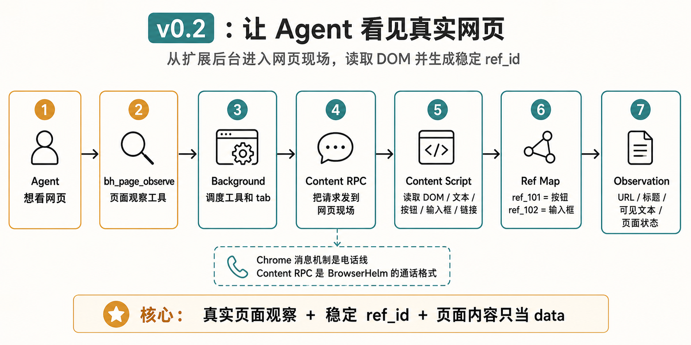
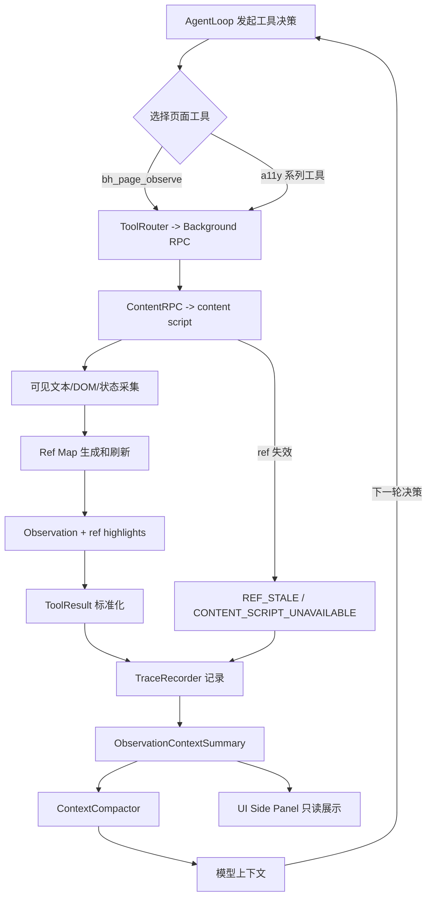

# v0.2 — Page Observation + Ref Prototype

## 1. 背景

v0.1 只能运行 mock loop，无法理解真实网页。BrowserHelm 的核心差异是 a11y-first 页面理解和 stable ref，因此必须尽早建立 content script、page observation 和 ref map。

当前用户遇到的问题：Agent 不能知道页面上有什么，也不能把页面状态压缩成稳定、可解释的 observation。

现有系统限制：没有真实页面观察，没有 ref_id 到 DOM node 的映射，也无法在不同 turn 间稳定引用可交互元素。

为什么现在要做：v0.2 是后续 v0.3 结构化页面数据、v0.4 完整 UI 和 v1.0 只读诊断的地基，先把“看见页面”和“稳定编号”做好。

## 2. 用户故事

US1. 作为浏览器用户，我希望 agent 能识别当前页面的按钮、输入框和链接，以便理解当前页面的结构和状态。

US2. 作为开发者，我希望每个可交互元素都有 stable ref_id，以便模型不需要猜 CSS selector。

US3. 当页面跳转或 DOM 更新导致 ref 失效时，作为 agent runtime，我希望能返回 REF_STALE 并提示重新观察，以便避免基于旧页面状态继续推理。

US4. 作为开发者，我希望 observation 结果包含 URL、title、visible text、页面状态和 ref map 摘要，以便后续结构化页面数据复用。

US5. 作为安全测试者，我希望页面里的恶意文字只被当作页面内容，而不是系统指令或工具指令。

US6. 作为 runtime，我希望 observation 知道 currentDomain / origin，以便后续 domain policy、memory 和 workflow replay 使用。

## 3. 目标

本 Issue 要完成：

- 建立 content script RPC。
- 实现 `bh_page_observe`。
- 实现 `bh_a11y_snapshot`、`bh_a11y_resolve_ref`、`bh_a11y_refresh_refs`。
- 实现 ref_id 生成、ref_id -> DOM node 映射、ref 失效检测基础机制。
- 实现 observation budget、visible text summary、page state summary。
- 实现 full observation 与 context observation summary 分层。
- 实现 currentDomain / origin metadata。
- 增加 prompt injection HTML fixture。
- 补充 ref stale / content RPC / observe failure 的结构化错误码。

### 任务拆解

- T1. 建立 content RPC 协议。
- T2. 实现 observation builder。
- T3. 实现 accessibility-like tree 基础序列化。
- T4. 实现 ref map 生命周期。
- T5. 实现 interactive candidates 初步扫描。
- T6. 定义 observation 压缩和摘要规则。
- T7. 接入 ToolRouter。
- T8. 补充 REF_STALE、CONTENT_SCRIPT_UNAVAILABLE、OBSERVATION_BUDGET_EXCEEDED 等错误码。
- T9. 增加 domain metadata 读取。
- T10. 增加 prompt injection fixture，验证页面内容不会变成 agent instruction。

## 4. 不做什么

本 Issue 明确不处理：

- 不做正式 cockpit UI。
- 不做完整交互元素 tab。
- 不做 form-specific 工具。
- 不做表单字段诊断。
- 不做 console/network debug。
- 不做 DevTools/CDP。
- 不做 screenshot/vision。
- 不做 click/type/scroll/nav 等 mutating action。
- 不做 iframe/shadow DOM 深度支持。
- 不做正式 prompt injection eval runner。

## 5. 产品方案

### 功能入口

通过 v0.1 agent loop 调用真实 page/a11y read-only tools。

### 用户路径

任务开始 -> bh_page_observe -> 生成 full observation / visible text / page state / ref map -> 完整结果写入 trace -> 模型获得可解释页面摘要。

### 正常状态

Observation 返回 URL、title、visible text summary、page state、ref map 摘要和 interactive candidates。

### 空状态

页面无可交互元素时，返回 empty observation 和 reason。

### 错误状态

ref 不存在返回 REF_NOT_FOUND；DOM 变化后返回 REF_STALE；权限不允许注入返回 CONTENT_SCRIPT_UNAVAILABLE；摘要超预算返回 OBSERVATION_BUDGET_EXCEEDED。

### 权限 / 可见性

需要 content script 注入 all_urls。chrome://、Chrome Web Store 等不可注入页面要明确提示。

## 6. 设计图 / 视觉参考





设计来源

Figma: 不适用
截图:
- docs/roadmap/assets/v0.2-page-observation-architecture.png
- docs/design/v0.2-page-observation-ref/01-page-observation.png
- docs/design/v0.2-page-observation-ref/02-ref-mapping.png
文档: docs/roadmap/v0.2-page-observation.md
其他: 用户提供的 GPT 生成设计图

设计范围

本 Issue 需要实现的设计范围：页面观察 tab、Ref 映射 tab 的只读 MVP。

明确不需要实现的设计范围：交互元素 tab、表单字段 tab、完整 Cockpit UI、动作执行 UI。

关键视觉要求

布局: 适合 extension side panel，右侧面板信息密度适中。
文案: 清楚解释当前页面摘要、URL / 标题、可见文本、页面状态和 Ref 映射。
颜色: 暖色、专业、克制、高对比。
字体: 中文字体清晰可读，避免系统默认感。
间距: 表格和摘要卡片可扫描。
动效: 不要求。
响应式: 支持窄 side panel 宽度。

设计验收方式

是否需要截图对比: 是
是否需要浏览器 / 桌面端手动验证: 是
需要覆盖的状态: 页面观察、Ref 映射、empty、error。

## 7. 技术方案

### 现状

无真实页面工具。

### 目标设计

content script 提供 page/a11y/dom 能力，background 通过 RPC 调用。

### 数据流 / 调用链

AgentLoop -> ToolRouter -> BackgroundRPC -> ContentRPC -> page/a11y/dom module -> full Observation ToolResult -> TraceRecorder -> Observation summary -> ContextCompactor。

### 关键类型 / API

```ts
type ElementRef = {
  refId: string;
  role?: string;
  name?: string;
  tagName: string;
  visible: boolean;
  disabled?: boolean;
};

type Observation = {
  url: string;
  title: string;
  currentDomain: string;
  origin: string;
  visibleText: string;
  pageState: string;
  refSummary: ElementRef[];
};

type ObservationContextSummary = {
  url: string;
  title: string;
  currentDomain: string;
  origin: string;
  pageType?: string;
  pageStateSummary: string;
  visibleTextSummary: string;
  interactiveCount: number;
  refHighlights: ElementRef[];
  warnings?: string[];
};
```

Context 规则：

- 完整 DOM 不进入模型上下文。
- 完整 a11y-like tree 不进入模型上下文。
- 完整 ref map 不进入模型上下文。
- 完整 visible text 不进入模型上下文。
- 模型只接收 `ObservationContextSummary` 和必要的 ref highlights。
- 页面文本中的指令式内容只能作为 data 进入 observation，不得提升为 system/developer/tool instruction。

### 错误处理

所有 content RPC timeout、不可注入、ref stale、observation over budget 都返回结构化 ToolResult。

### 复用与约束

优先复用：DOM APIs、dom-accessibility-api、统一 ToolResult。

不要重复实现：selector 猜测逻辑、RPC parser、ref lifecycle。

## 8. 目录结构

```txt
src/page/observe/
├── build-observation.ts
├── visible-text.ts
├── page-metadata.ts
├── page-state.ts
├── mutation-watch.ts
└── observation-compressor.ts

src/page/a11y/
├── accessible-name.ts
├── role-resolver.ts
├── ref-map.ts
├── ref-resolver.ts
└── ref-staleness.ts

src/page/dom/
├── element-finder.ts
├── selector-utils.ts
└── page-state-reader.ts

src/tools/page/
├── bh-page-observe.ts
├── bh-page-read-visible-text.ts
├── bh-page-read-article.ts
└── bh-page-wait-until-stable.ts

src/tools/a11y/
├── bh-a11y-snapshot.ts
├── bh-a11y-resolve-ref.ts
└── bh-a11y-refresh-refs.ts

tests/dom/page/observe/
├── build-observation.test.ts
├── visible-text.test.ts
├── page-state.test.ts
└── observation-compressor.test.ts

tests/dom/page/a11y/
├── accessible-name.test.ts
├── ref-map.test.ts
├── ref-resolver.test.ts
└── ref-staleness.test.ts

tests/dom/page/dom/
├── element-finder.test.ts
└── page-state-reader.test.ts

tests/node/tools/page/
├── page-tools.test.ts
└── a11y-tools.test.ts

tests/browser/extension/background-content/
├── content-rpc-observe.test.ts
└── ref-lifecycle.test.ts

tests/fixtures/pages/
├── basic-form.html
├── interactive-elements.html
├── dynamic-page.html
└── security/
    └── prompt-injection.html

tests/helpers/
├── dom-test-page.ts
└── mock-content-rpc.ts
```

## 9. 依赖关系

前置依赖：

- v0.1 Agent Kernel

后续依赖：

- v0.3 Structured Page Data
- v0.31 Interactive Elements
- v0.32 Form Fields
- v0.33 Safe Action Readiness
- v0.4 Complete Cockpit UI
- v1.0 Page Inspector + Form Doctor

## 10. 验收标准

AC1. 覆盖 US1：当页面有按钮/输入框/链接时，bh_a11y_snapshot 返回可读结构和 ref_id。

AC2. 覆盖 US2：模型和后续工具可以用 ref_id 定位元素，不需要 CSS selector。

AC3. 覆盖 US3：当 ref 不存在或 stale 时，系统返回明确错误并建议 re-observe。

AC4. 覆盖 US4：observation 包含 URL、title、visible text、page state 和 ref map 摘要，且可被后续工具和 UI 复用。

AC5. 覆盖 US5：prompt injection fixture 中的 “ignore previous instructions” 类文本只出现在 observation data / visible text summary，不会改变 tool policy 或 system prompt。

AC6. 覆盖 US6：observation 包含 currentDomain / origin，并能被后续 domain boundary 使用。

AC7. full observation 写入 trace，模型上下文只接收 observation summary；超出 budget 时返回 `OBSERVATION_BUDGET_EXCEEDED` 或截断说明。

AC8. 已有 v0.1 AgentLoop、ToolRegistry、TraceRecorder 行为不受影响。

AC9. 实际改动不超出「改动目录结构」；如必须超出，PR 需要写偏离说明。

AC10. 如涉及设计图，实现结果符合「设计图 / 视觉参考」中列出的范围和关键视觉要求。
