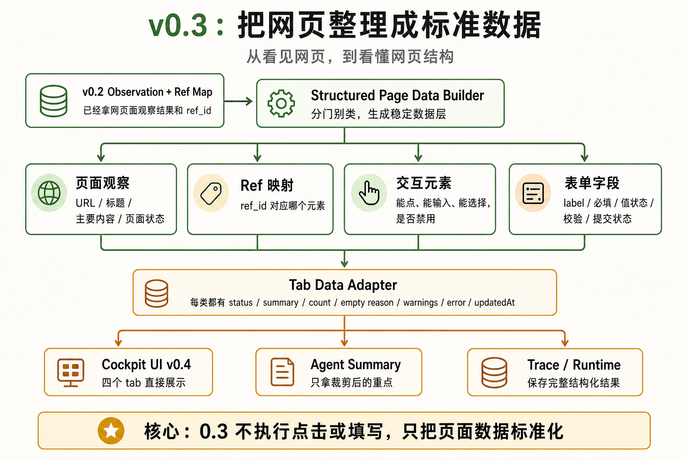
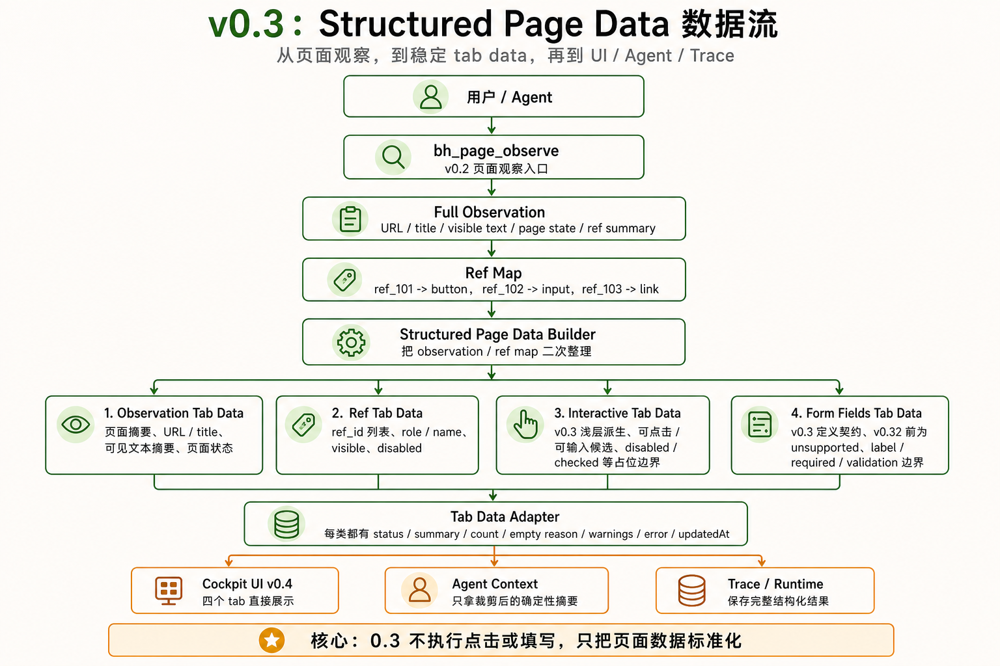

# v0.3 — Structured Page Data Prototype





## 1. 背景

v0.2 已经能读取真实页面，并建立 URL、title、visible text、page state 和 stable ref map。下一步不是立刻做完整 UI，而是把页面进一步结构化成可被 Agent 和 Cockpit 稳定消费的数据层。

当前用户遇到的问题：页面 observation 有了，但页面观察、Ref 映射、交互元素、表单字段还没有统一的数据外壳、状态语义和摘要规则。

现有系统限制：没有统一的 structured page data contract、tab data adapter、empty / unsupported / error 状态语义，以及面向 Agent context 的确定性摘要规则。

为什么现在要做：v0.3 是 v0.4 完整 Cockpit UI 和 v1.0 Page Inspector + Form Doctor 的数据基础。

## 2. 用户故事

US1. 作为开发者，我希望能从 v0.2 observation/ref map 生成统一的 structured page data，以便后续 UI、runtime、trace 和 Agent context 使用同一份数据 contract。

US2. 作为开发者，我希望四类 tab data 都有一致的 status、summary、count、empty reason、warning、error 和 updatedAt，以便不同页面状态不会被裸数组或散字段表达。

US3. 作为后续 runtime 开发者，我希望完整 structured page data 写入 runtime snapshot / trace，而 Agent context 只接收裁剪后的确定性摘要，以便避免上下文膨胀和敏感数据泄露。

US4. 作为 UI 开发者，我希望 observation、ref、interactive elements、form fields 能作为四类 tab 数据进入 Cockpit。

## 3. 目标

本 Issue 要完成：

- 建立 structured page data 总体 schema。
- 建立 observation、refs、interactive、forms 四类 tab data schema。
- 明确四类数据：页面观察、Ref 映射、交互元素、表单字段。
- 定义统一 tab data 外壳：status、summary、count、items、empty reason、warnings、error、updatedAt。
- 定义从 v0.2 observation/ref map 到 structured page data 的 adapter。
- 定义 deterministic context summary 裁剪规则。
- 为 v0.4 Cockpit UI 提供稳定数据 contract。
- 保持单 AgentLoop，不引入 sub-agent；结构化数据只作为 tools/UI/context summary 的输入。

### 任务拆解

- T1. 定义 structured page data 总体 contract。
- T2. 明确 observation / refs / interactive elements / form fields 的边界。
- T3. 定义 tab data adapter，供 v0.4 UI 消费。
- T4. 定义 tab status、empty state、unsupported state、warning 和 error。
- T5. 明确 `v0.31`、`v0.32`、`v0.33` 的依赖关系和验收边界。

## 4. 不做什么

本 Issue 明确不处理：

- 不做完整 Cockpit UI。
- 不做自动填写。
- 不做 submit-with-approval。
- 不做完整 interactive element discovery；该能力归属 `v0.31`。
- 不做完整 form field reader、label resolver、validation reader；该能力归属 `v0.32`。
- 不做 action readiness、risk classification、approval hook；该能力归属 `v0.33`。
- 不做 DevTools/CDP。
- 不做 memory / workflow replay。
- 不做 screenshot/vision。
- 不做 sub-agent / agent-as-tool / delegate_to_agent。

## 5. 产品方案

### 功能入口

通过 v0.2 observation 和 ref map 生成 structured page data，供 runtime snapshot、trace、Agent context summary 和后续 Cockpit UI 使用。

### 用户路径

observe 页面 -> 建立 ref map -> structured page data builder -> tab data adapter -> 输出四类 tab data 和裁剪 summary。

### 正常状态

四类数据都能以稳定 schema 输出，并带有 status、summary、count、items、empty reason、warnings、error、updatedAt。

### 空状态

页面已检查且没有匹配数据时返回 `empty` 和明确 empty reason，而不是空白数组裸返回。

### 不支持状态

当前版本或页面能力暂不支持生成某类数据时返回 `unsupported`，不得伪装成 `empty`。

### 错误状态

structured page data 构建过程中的局部失败不阻断其他 tab data；失败 tab 返回结构化 warning 或 error。底层 observation/ref 失败继续复用 v0.2 的 `REF_STALE`、`CONTENT_SCRIPT_UNAVAILABLE`、`OBSERVATION_FAILED`。

### 权限 / 可见性

本阶段默认只读，不触发页面修改。

## 6. 设计图 / 视觉参考


### 数据流图


### 边界说明

v0.3 不执行页面动作，不实现完整交互元素识别、完整表单字段读取或动作前安全检查；它只把 v0.2 observation/ref map 整理成四类稳定 tab data，供 v0.4 UI、Agent context summary 和 trace/runtime snapshot 消费。

## 7. 技术方案

### 现状

已有 page observation 和 ref map，但缺少面向 UI 与工具的二次结构化数据层。

### 目标设计

以 v0.2 observation/ref map 为输入，生成 structured page data。数据层不直接渲染 UI，也不执行页面动作。

### 数据流 / 调用链

bh_page_observe -> observation/ref map -> structured page data builder -> tab data adapter -> runtime snapshot / trace / compact context summary。

### 关键类型 / API

```ts
type StructuredPageData = {
  observation: ObservationTabData;
  refs: RefTabData;
  interactive: InteractiveTabData;
  forms: FormFieldsTabData;
};

type TabDataStatus = 'ready' | 'empty' | 'partial' | 'error' | 'unsupported';

type TabData<TItem> = {
  status: TabDataStatus;
  summary: string;
  count: number;
  items: TItem[];
  updatedAt: string;
  warnings: StructuredPageWarning[];
  error?: StructuredPageError;
  emptyReason?: string;
};
```

Context 规则：

- structured page data 的完整对象写入 trace / runtime snapshot。
- 模型上下文只接收 deterministic context summary，例如 tab summary、关键 refs、计数、warning 和主要状态。
- v0.3 不调用模型生成 summary。
- v0.3 不新增多 agent 决策类型。
- v0.3 不新增模型可见 structured data tool；优先在 runtime 内部从 `bh_page_observe` 结果生成 structured snapshot。

### 错误处理

局部数据构建失败不阻断其他 tab data。每个 tab 都要有独立 status、summary、warnings 和 error。`empty` 表示已检查且没有匹配数据；`unsupported` 表示当前版本或页面能力暂不支持生成该类数据。

### 复用与约束

优先复用：v0.2 observation、ref map、ToolResult、runtime snapshot。

不要重复实现：DOM 查询、ref 生命周期、UI store、完整交互元素识别、完整表单字段读取、action readiness。

## 8. 目录结构

```txt
src/page/structured/
├── structured-page-data.ts
├── tab-data-adapter.ts
├── structured-page-errors.ts
└── empty-state-reasons.ts

src/shared/schemas/
├── structured-page-data.ts
├── observation-tab.ts
├── ref-tab.ts
├── interactive-tab.ts
└── form-fields-tab.ts

tests/dom/page/structured/
├── structured-page-data.test.ts
├── tab-data-adapter.test.ts
└── empty-state-reasons.test.ts

tests/node/shared/schemas/
├── structured-page-data.test.ts
├── interactive-tab.test.ts
└── form-fields-tab.test.ts

tests/fixtures/pages/
├── interactive-elements.html
├── basic-form.html
└── empty-page.html
```

## 9. 依赖关系

前置依赖：

- v0.1 Agent Kernel
- v0.2 Page Observation + Ref

后续依赖：

- v0.31 Interactive Elements
- v0.32 Form Fields
- v0.33 Safe Action Readiness
- v0.4 Complete Cockpit UI
- v1.0 Page Inspector + Form Doctor

## 10. 验收标准

AC1. 覆盖 US1：给定一次成功的 v0.2 observation，系统能生成 `StructuredPageData`，包含 observation、refs、interactive、forms 四类 tab data。

AC2. 覆盖 US2：每类 tab data 都包含统一的 status、summary、count、items、updatedAt、warnings，并能表达 empty reason 和 error。

AC3. 覆盖 US3：完整 structured page data 写入 runtime snapshot / trace；Agent context 只接收 deterministic context summary。

AC4. 覆盖 US4：四类 tab data 都能被 v0.4 UI 直接消费。

AC5. `observation` 和 `refs` tab data 使用 v0.2 真实数据；`interactive` 可基于 v0.2 `refSummary` 浅层派生；`forms` 在完整读取未实现时必须返回 `unsupported` 或明确状态，不得伪装成完整表单诊断。

AC6. `empty` 和 `unsupported` 必须区分：empty 表示已检查且没有匹配数据，unsupported 表示当前版本或页面能力不支持。

AC7. v0.3 不调用模型生成 summary，不新增模型可见 structured data tool，不实现 click/type/submit/action readiness。

AC8. 已有 v0.1/v0.2 行为不受影响。

AC9. 实际改动不超出「改动目录结构」；如必须超出，PR 需要写偏离说明。
