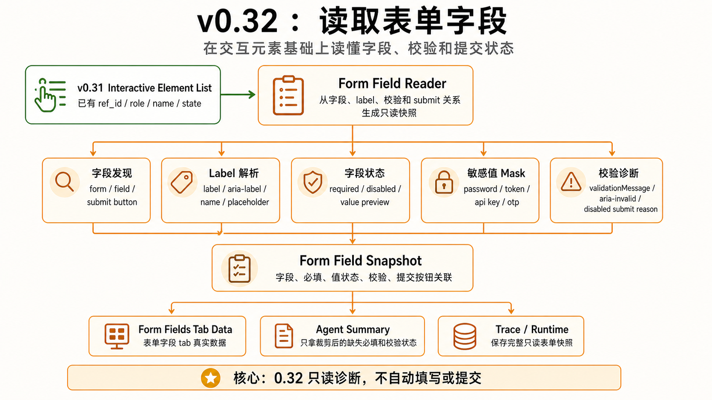

# v0.32 — Form Fields Prototype




## 1. 背景

v0.31 已经能稳定识别交互元素，v0.32 在此基础上读取表单字段、字段状态、校验信息和提交按钮关联。

当前用户遇到的问题：用户不知道表单为什么不能提交，Agent 也缺少字段级结构化信息。

现有系统限制：缺少 label 识别、required/value state、validationMessage、aria-invalid、submit button 关联。

为什么现在要做：表单字段是 v1.0 Page Inspector + Form Doctor 的核心数据。

## 2. 用户故事

US1. 作为 QA，我希望看到表单字段、必填项和校验错误，以便快速判断页面质量。

US2. 作为用户，我希望系统能解释 submit disabled 的可能原因，以便知道下一步该改什么。

US3. 作为开发者，我希望字段快照默认 mask 敏感值，以便 trace 和 UI 不泄露隐私。

US4. 作为 Agent，我希望表单字段绑定 ref_id，以便后续填写和验证能复用同一套引用体系。

## 3. 目标

本 Issue 要完成：

- 实现 form discovery。
- 实现 form field snapshot。
- 实现 label/type/required/value/validation/aria-invalid 读取。
- 实现 submit button 关联。
- 实现 disabled submit reason 的只读推断。

### 任务拆解

- T1. 实现 form-reader。
- T2. 实现 label resolver。
- T3. 实现 validation-reader。
- T4. 实现 submit-detector。
- T5. 实现 sensitive field masker。
- T6. 实现 read-only form tools。

## 4. 不做什么

本 Issue 明确不处理：

- 不做自动填写。
- 不做 submit-with-approval。
- 不做完整 FormPanel UI。
- 不做跨 iframe 表单深度支持。

## 5. 产品方案

### 功能入口

通过 v0.3 structured page data 构建表单字段 tab data。

### 用户路径

observe 页面 -> ref map -> 交互元素 -> 表单字段读取 -> 输出字段状态和诊断摘要。

### 正常状态

返回 forms、fields、required、valuePreview、validation、submit button 状态。

### 空状态

没有表单时返回“当前页面未检测到表单”。

### 错误状态

label 识别失败、字段状态不可读、submit button 未找到都返回结构化 warning。

### 权限 / 可见性

只读。password/token/API key 默认 mask。

## 6. 设计图 / 视觉参考


设计来源

Figma: 不适用
截图: docs/roadmap/assets/v0.32-form-fields-architecture.png
文档: docs/roadmap/v0.32-form-fields.md
其他: 用户提供的 GPT 生成设计图

设计范围

本 Issue 需要实现的设计范围：表单字段 tab、字段表格、校验摘要、提交按钮状态。

明确不需要实现的设计范围：自动填写、submit-with-approval、完整 FormPanel UI。

关键视觉要求

布局: 字段列表、校验摘要、提交按钮状态分区清楚。
文案: 清楚解释字段必填、当前值、校验状态、错误信息和 ref_id。
颜色: error/warning/success 状态明确但不刺眼。
字体: 中文字体清晰可读。
间距: 表格适合 side panel 扫描。
动效: 不要求。
响应式: 支持窄 side panel 宽度。

设计验收方式

是否需要截图对比: 是
是否需要浏览器 / 桌面端手动验证: 是
需要覆盖的状态: 有表单、无表单、字段有效、字段无效、submit disabled。

## 7. 技术方案

### 现状

已有交互元素数据，但没有字段级表单结构。

### 目标设计

基于 ref map 和 interactive elements 构建 form field snapshot。

### 数据流 / 调用链

interactive elements -> form-reader -> validation-reader -> submit-detector -> FormFieldSnapshot[]。

### 关键类型 / API

```ts
type FormFieldSnapshot = {
  refId: string;
  label?: string;
  name?: string;
  type: string;
  valuePreview: string;
  required: boolean;
  disabled: boolean;
  validationMessage?: string;
  ariaInvalid?: boolean;
  sensitive: boolean;
};
```

### 错误处理

字段级错误进入 warnings，不阻断整个 form snapshot。

### 复用与约束

优先复用：v0.31 interactive elements、v0.2 ref map、masking policy。

不要重复实现：自动填写、submit action、FormPanel 状态。

## 8. 目录结构

```txt
src/page/dom/
├── form-reader.ts
├── label-resolver.ts
├── validation-reader.ts
├── submit-detector.ts
└── sensitive-field.ts

src/tools/form/
├── bh-form-list.ts
├── bh-form-inspect.ts
├── bh-form-read-fields.ts
├── bh-form-find-missing-required.ts
├── bh-form-find-validation-errors.ts
└── bh-form-find-disabled-submit-reason.ts

tests/dom/page/forms/
├── form-reader.test.ts
├── label-resolver.test.ts
├── validation-reader.test.ts
├── submit-detector.test.ts
└── sensitive-field.test.ts

tests/node/tools/
└── form-tools.test.ts
```

## 9. 依赖关系

前置依赖：

- v0.2 Page Observation + Ref
- v0.3 Structured Page Data
- v0.31 Interactive Elements

后续依赖：

- v0.33 Safe Action Readiness
- v0.4 Complete Cockpit UI
- v1.0 Page Inspector + Form Doctor

## 10. 验收标准

AC1. 覆盖 US1：表单字段、必填项和校验错误能被读取。

AC2. 覆盖 US2：submit disabled 能返回可能原因或明确说明无法判断。

AC3. 覆盖 US3：敏感字段默认 mask。

AC4. 覆盖 US4：字段数据保留 ref_id。

AC5. 已有 v0.2/v0.31 行为不受影响。

AC6. 实际改动不超出「改动目录结构」；如必须超出，PR 需要写偏离说明。

AC7. 如涉及设计图，实现结果符合「设计图 / 视觉参考」中列出的范围和关键视觉要求。
