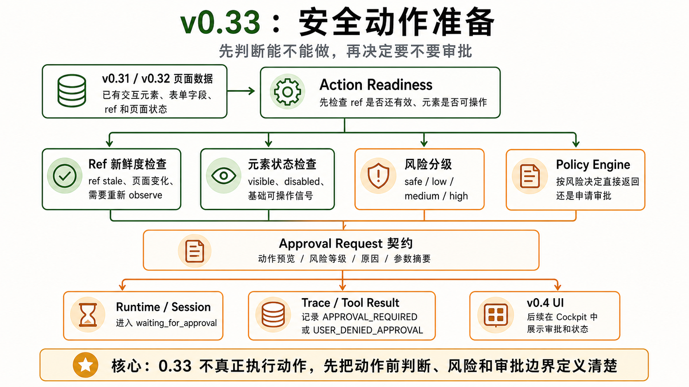

# v0.33 — Safe Action Readiness Prototype




## 1. 背景

v0.31 和 v0.32 已经把页面结构化成交互元素和表单字段。v0.33 不追求完整自动化动作，而是为后续 click/type/form action 准备安全数据、错误码和审批基础。这个版本等价于早期讨论里的 `v0.2.5`：开始做最小 Approval Hook，但不做完整 UI。

当前用户遇到的问题：如果没有动作前检查和风险信息，后续 Agent 动作会变成直接操作页面，难以解释和恢复。

现有系统限制：缺少 action readiness、action contract、changedPage/staleRefs/requiresObserve 这些 runtime 标记。

为什么现在要做：v0.4 UI 需要展示工具结果和基础 Approval，v1.1 才会真正进入辅助填写和提交确认。

## 2. 用户故事

US1. 作为用户，我希望系统在动作前知道目标元素是否仍然有效，以便减少误操作。

US2. 作为开发者，我希望后续 action 都有统一 contract，以便 trace 和 UI 可以一致展示。

US3. 当 ref stale 或页面变化时，作为 runtime，我希望能明确要求重新 observe。

US4. 作为 UI 开发者，我希望基础 approval request 数据已经可用，以便 v0.4 展示审批骨架。

US5. 作为用户，我希望高风险动作不会直接执行，而是先暂停 run 并等待批准或拒绝。

## 3. 目标

本 Issue 要完成：

- 定义 action readiness contract。
- 定义 action tool result contract。
- 建立 changedPage / staleRefs / requiresObserve 标记。
- 建立基础 risk classification。
- 建立基础 approval request schema。
- 建立最小 PolicyEngine 和 approval hook。
- 建立 approval_required -> pause run -> approve/deny -> resume/fail 的 runtime contract。

### 任务拆解

- T1. 定义 action-readiness。
- T2. 定义 action-result contract。
- T3. 实现 ref freshness check。
- T4. 实现 page change detector 基础能力。
- T5. 实现 risk-classifier 骨架。
- T6. 实现 approval request schema。
- T7. 实现最小 PolicyEngine。
- T8. 定义 waiting_for_approval session 状态和 approval events。
- T9. 定义 USER_DENIED_APPROVAL ToolResult。

## 4. 不做什么

本 Issue 明确不处理：

- 不做完整 click/type/nav 实现。
- 不做自动填写。
- 不做 submit-with-approval。
- 不做完整 approval UI。
- 不做 workflow replay。
- 不做 memory。
- 不做 sub-agent。

## 5. 产品方案

### 功能入口

后续 action tool 在执行前调用 action readiness，确认 ref、状态和风险。

### 用户路径

Agent 选择 ref -> readiness check -> risk classification -> PolicyEngine -> approval request 或可执行结果 -> 后续版本执行 action。

### 正常状态

返回 canAct、reason、risk、requiresObserve、nextHints；高风险动作返回 approval request 并让 session 进入 waiting_for_approval。

### 空状态

没有可动作目标时返回 ELEMENT_NOT_ACTIONABLE。

### 错误状态

ref stale、元素不可见、元素 disabled、页面状态过期都返回结构化错误。

### 权限 / 可见性

本阶段不实际修改页面。

## 6. 设计图 / 视觉参考


设计来源

Figma: 不适用
截图: docs/roadmap/assets/v0.33-safe-action-readiness-architecture.png
文档: docs/roadmap/v0.33-safe-action-readiness.md
其他: 用户提供的 GPT 生成设计图

设计范围

本 Issue 需要实现的设计范围：动作前检查链路、风险分级、PolicyEngine、approval request、runtime 等待审批状态。

明确不需要实现的设计范围：真实 click/type/submit 执行器、完整 approval UI、workflow replay。

关键视觉要求

布局: 先表达只读基础数据，再表达 readiness / risk / policy / approval 的串联关系。
文案: 清楚解释“能不能做”“为什么不能做”“是否需要重新 observe”“是否要审批”。
颜色: 绿色表示只读基础能力，橙色表示风险、审批和 runtime 契约。
字体: 中文标题清晰，英文 contract 名称可快速扫读。
间距: 适合 roadmap 文档内嵌阅读。
动效: 不要求。
响应式: 不适用。

设计验收方式

是否需要截图对比: 是
是否需要浏览器 / 桌面端手动验证: 否
需要覆盖的状态: canAct、stale ref、requiresObserve、approval required。

## 7. 技术方案

### 现状

已有页面结构化数据，但缺少动作准备层。

### 目标设计

将 action readiness 作为后续 mutating action 的前置 contract。

### 数据流 / 调用链

ref -> action readiness -> risk classifier -> PolicyEngine -> ApprovalManager hook -> trace/tool result。

### 关键类型 / API

```ts
type ActionReadiness = {
  canAct: boolean;
  reason: string;
  risk: 'safe' | 'low' | 'medium' | 'high';
  staleRefs: boolean;
  requiresObserve: boolean;
  nextHints?: string[];
};

type ApprovalRequest = {
  id: string;
  runId: string;
  stepId: string;
  tool: string;
  argsPreview: unknown;
  risk: 'safe' | 'low' | 'medium' | 'high';
  reason: string;
  status: 'pending' | 'approved' | 'denied' | 'expired';
};
```

### 错误处理

readiness failure 不 throw，统一返回 ToolResult。

### 复用与约束

优先复用：v0.2 ref map、v0.31 element state、v0.32 form fields。

不要重复实现：action executor、approval UI、workflow runner。

## 8. 目录结构

```txt
src/page/dom/
├── action-readiness.ts
├── page-change-detector.ts
└── action-result.ts

src/agent/policy/
├── risk-classifier.ts
├── policy-engine.ts
└── approval-request.ts

src/runtime/approval/
├── approval-manager.ts
├── approval-store.ts
└── approval-events.ts

src/shared/schemas/
└── approval.schema.ts

tests/dom/page/dom/
├── action-readiness.test.ts
├── page-change-detector.test.ts
└── action-result.test.ts

tests/node/agent/policy/
├── risk-classifier.test.ts
├── policy-engine.test.ts
└── approval-request.test.ts

tests/node/runtime/approval/
├── approval-manager.test.ts
└── approval-events.test.ts

tests/node/shared/schemas/
└── approval.test.ts
```

## 9. 依赖关系

前置依赖：

- v0.2 Page Observation + Ref
- v0.31 Interactive Elements
- v0.32 Form Fields

后续依赖：

- v0.4 Complete Cockpit UI
- v1.1 Assisted Form Fill + Frontend Debug

## 10. 验收标准

AC1. 覆盖 US1：动作前能判断 ref 是否仍然有效。

AC2. 覆盖 US2：action result contract 包含 `changedPage`、`staleRefs`、`requiresObserve`。

AC3. 覆盖 US3：ref stale 或页面变化时明确要求 re-observe。

AC4. 覆盖 US4：approval request 数据可被 v0.4 UI 使用。

AC5. 覆盖 US5：高风险动作返回 `APPROVAL_REQUIRED`，session 进入 `waiting_for_approval`，不会直接执行。

AC6. approve 后 session 可 resume；deny 后返回 `USER_DENIED_APPROVAL` ToolResult，并写入 trace。

AC7. 已有 v0.2/v0.31/v0.32 行为不受影响。

AC8. 实际改动不超出「改动目录结构」；如必须超出，PR 需要写偏离说明。

AC9. 设计图验收通过条件：roadmap 内嵌图片与第 6 节范围、文案和状态说明一致，能够清楚表达 readiness、risk、policy、approval 和 waiting_for_approval 的关系。
