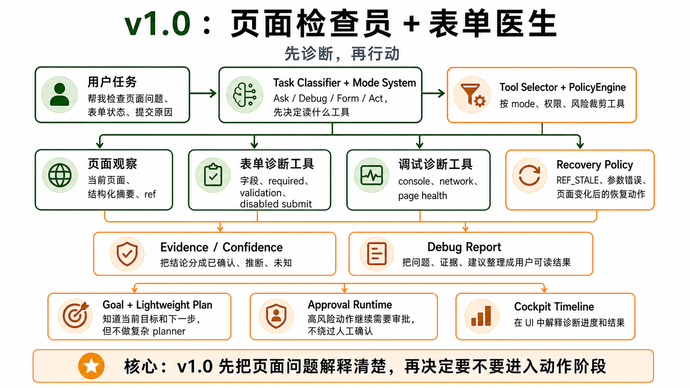

# v1.0 — Page Inspector + Form Doctor




## 1. 背景

v0.x 已经完成了 loop、页面观察、安全动作和 cockpit UI，但首发版本不应该一口气承担自动填表、提交审批、深度 debug 和大面板工作台。BrowserHelm 的第一个发布版本更适合先做成“页面检查员 + 表单医生”。

当前用户遇到的问题：页面为什么坏了、表单为什么不能提交、哪些字段缺失、按钮为什么 disabled，这些问题都很高频，但用户首先需要的是清楚诊断，而不是立刻让 agent 动手。

现有系统限制：虽然已有可执行动作和 cockpit，但还缺少面向首发场景的表单诊断工具、只读 debug summary 和面向用户行动的解释。

为什么现在要做：这是 BrowserHelm 的第一个可发布版本，重点验证“先看懂页面，再解释问题”的产品价值。同时 v1.0 必须把 HITL / Policy / Approval Runtime 变成正式安全能力，为 v1.1 的填写和提交动作兜底。

## 2. 用户故事

US1. 作为前端开发者，我希望 agent 能读出当前页面的 form 状态和基础错误信号，以便快速理解问题在哪里。

US2. 作为 QA，我希望 agent 能列出表单字段、必填项、validation errors 和 disabled submit 原因，以便快速检查页面质量。

US3. 当页面存在 console error 或 network failure 时，作为用户，我希望系统能给出浅层摘要和下一步建议，而不是只贴原始错误。

US4. 当页面没有表单或没有明显错误时，作为用户，我希望系统明确告诉我当前页面状态，而不是显示空白。

US5. 作为安全敏感用户，我希望高风险动作必须经过 PolicyEngine 和 approval runtime，以便 agent 不能绕过人工确认。

US6. 作为用户，我希望系统能根据我的一句话自动选择 Ask / Debug / Form / Act mode，并说明为什么。

US7. 作为用户，我希望诊断结论带证据和信心等级，以便知道哪些是确定结论，哪些只是推断。

US8. 作为用户，我希望可以中途打断 run，改成“只读诊断”或修改目标。

US9. 作为开发者，我希望失败后系统有明确恢复策略，例如 REF_STALE 自动 re-observe。

US10. 作为用户，我希望最终看到人类可读的调试报告，而不是 JSON trace。

US11. 作为用户，我希望能看到 Debug/Form 任务的轻量计划进度，但系统可以根据观察结果动态调整计划。

## 3. 目标

本 Issue 要完成：

- 实现 form list/inspect/read/find missing required/find validation errors/find disabled submit reason。
- 实现 read-only page health summary：console errors、network failures、基础页面状态。
- 让 cockpit 中已有的 chat、timeline、tool inspector、observation preview 能承载诊断流程。
- 完成本地 trace 和基础安全脱敏。
- 引入 mode system 雏形，用 Ask / Debug / Form 控制工具暴露、prompt 和 context policy。
- 完成正式 HITL / Policy / Approval Runtime，默认用于阻断高风险动作并记录审计 trace。
- 实现 TaskClassifier。
- 实现 ToolSelector。
- 实现 RecoveryPolicy。
- 实现 Goal / SuccessCriteria。
- 实现 mode-based lightweight plan。
- 实现 Evidence / Confidence / AgentFinding。
- 实现 Capability / Permission model。
- 实现 interrupt / revise goal。
- 实现 human-readable DebugReport。
- 实现 token/cost/latency 基础观测字段。

### 任务拆解

- T1. 实现 form-reader、validation-reader、submit state reader。
- T2. 实现 read-only form tools。
- T3. 实现 debug-reader，收集 console errors、network failures、page health summary。
- T4. 实现 debug summary tools。
- T5. 实现面向用户行动的解释模板。
- T6. 接入 secret masking 和 trace summary。
- T7. 更新 system prompt / tool policy，优先诊断而非动作。
- T8. 补充 v1.0 错误码和 trace 字段。
- T9. 实现 mode system：Ask / Debug / Form / Act。
- T10. 实现 PolicyEngine、ApprovalManager、approval trace audit。
- T11. 实现 TaskClassifier：task -> mode + reason。
- T12. 实现 ToolSelector：mode + task + state + permission + risk -> available tools。
- T13. 实现 RecoveryPolicy：error code -> recovery action。
- T14. 实现 AgentFinding、Evidence、Confidence schema。
- T15. 实现 AgentRunInput.goal / successCriteria 和 finish 判断引用。
- T16. 实现 PlanBuilder、PlanState、PlanStep 和 mode plan templates。
- T17. 实现 plan progress summary 注入上下文。
- T18. 实现 capability / permission state。
- T19. 实现 interrupt / revise goal。
- T20. 实现 DebugReport 生成。
- T21. 记录 token/cost/latency 估算字段。

## 4. 不做什么

本 Issue 明确不处理：

- 不做表单自动填写。
- 不做批量填写。
- 不做 submit-with-approval。
- 不做 FormPanel / DebugPanel / TraceViewer detail。
- 不做长期 memory / workflow replay。
- 不做 CDP response body deep inspector。
- 不做 screenshot/vision。
- 不做 multi-tab、PDF、upload/download。
- 不做 domain adapters。
- 不做真正 sub-agent / agent-as-tool / delegate_to_agent；模式分工先由 mode / task runner 承担。
- 不做 memory、workflow replay、skill、MCP。
- 不做复杂 planner。
- 不做通用 planner agent。
- 不做 subtask graph。
- 不做正式 eval runner。

## 5. 产品方案

### 功能入口

用户在 Cockpit 输入“帮我检查这个页面为什么报错”“帮我看这个表单为什么不能提交”“帮我找缺失字段”。

TaskClassifier 会先把用户任务分类到 Ask / Debug / Form / Act，并给出 mode reason。ToolSelector 再根据 mode、权限、风险和当前页面状态裁剪工具。

### 用户路径

Agent classify task -> select mode -> build mode-based plan -> select tools -> observe 当前页面 -> 读取 forms / debug signals -> 更新 plan progress -> 生成带 evidence/confidence 的诊断 -> 输出 DebugReport -> 在 timeline 与 inspector 中解释发现 -> 用户决定是否进入后续填写或更深入排查。

### 正常状态

系统返回表单字段概览、required 缺失、validation errors、disabled submit 原因，以及 console / network 的浅层问题摘要。

### 空状态

没有表单时显示“当前页面未检测到表单”。没有明显错误时显示“未发现明显表单或页面异常”。

### 错误状态

content script unavailable、表单状态不可读、console/network 摘要不可用都要给出原因和下一步建议。

可恢复错误进入 recovering 状态；例如 REF_STALE 触发 re-observe，TOOL_ARGS_INVALID 请求模型修正参数，MODEL_OUTPUT_INVALID 进入 parser recovery 或 fail。

### 权限 / 可见性

默认只读诊断，不触发 mutating action。password/token/API key 默认 mask。

高风险动作即使不是 v1.0 的主路径，也必须被 runtime guard 阻断：submit、send、delete、upload、clipboard、execute JS、workflow replay 一律需要 approval。

## 6. 设计图 / 视觉参考


设计来源

Figma: 不适用
截图: docs/roadmap/assets/v1.0-page-inspector-form-doctor-architecture.png
文档: docs/roadmap/v1.0-page-inspector-form-doctor.md
其他: GPT Image 2 生成架构图

设计范围

本 Issue 需要实现的设计范围：TaskClassifier、Mode System、表单诊断工具、调试诊断工具、Evidence / Confidence、DebugReport、Goal / Plan、Approval Runtime 与 Cockpit 诊断时间线。

明确不需要实现的设计范围：自动填写、批量填写、提交执行器、workflow replay、screenshot/vision、完整 DevTools deep panel。

关键视觉要求

布局: 先表达任务分类和工具裁剪，再表达诊断工具、证据整理和最终报告。
文案: 明确强调“先诊断，再行动”，让用户一眼看懂系统为何默认只读。
颜色: 绿色表示页面理解与诊断基础能力，橙色表示策略、恢复、报告和审批边界。
字体: 中文优先，术语少量保留英文以帮助扫读。
间距: 适合 roadmap 内嵌阅读，不做 UI 细节堆叠。
动效: 不要求。
响应式: 不适用。

设计验收方式

是否需要截图对比: 是
是否需要浏览器 / 桌面端手动验证: 否
需要覆盖的状态: task classify、diagnose、recover、approval required、debug report。

## 7. 技术方案

### 现状

已有基础 page/a11y/element tools 和 cockpit UI。

### 目标设计

v1.0 只使用 read-only tools 和浅层 debug summaries。UI 复用 v0.4 完整 cockpit，不新增重型 panel；重点是把 tool result 解释清楚。

HITL runtime 在 v1.0 正式化：ToolRouter 执行前必须过 PolicyEngine；ApprovalManager 负责 request lifecycle；ApprovalDialog 通过 RuntimePort 接收事件；trace 记录 approval_requested / approved / denied。

### 数据流 / 调用链

Task -> select mode -> observe -> bh_form_list / bh_form_read_fields / bh_form_find_validation_errors / bh_debug_collect_page_health -> PolicyEngine guard -> compact context -> model diagnosis -> trace summary -> 用户结论。
Task -> TaskClassifier -> mode -> PlanBuilder -> ToolSelector -> observe/tools -> PlanState update -> RecoveryPolicy if failure -> AgentFinding[] -> DebugReport -> finish when successCriteria satisfied。

### 关键类型 / API

```ts
type FormFieldSnapshot = {
  refId: string;
  label?: string;
  name?: string;
  type: string;
  valuePreview: string;
  required: boolean;
  disabled: boolean;
  validationMessage?: string;
  sensitive: boolean;
};

type PageHealthSummary = {
  consoleErrors: ConsoleErrorSummary[];
  networkFailures: NetworkFailureSummary[];
  hasForm: boolean;
  pageStateSummary: string;
};

type AgentMode = 'ask' | 'debug' | 'form' | 'act';

type TaskClassification = {
  taskType: 'ask' | 'debug' | 'form' | 'act';
  mode: AgentMode;
  reason: string;
  confidence: 'low' | 'medium' | 'high';
};

type AgentRunInput = {
  task: string;
  goal?: string;
  successCriteria?: string[];
};

type PlanStep = {
  id: string;
  title: string;
  status: 'pending' | 'current' | 'done' | 'skipped' | 'blocked';
  expectedTool?: string;
};

type PlanState = {
  id: string;
  mode: AgentMode;
  steps: PlanStep[];
  updatedAt: number;
};

type Evidence = {
  source: 'observation' | 'form' | 'debug' | 'tool_result' | 'user';
  summary: string;
  refId?: string;
  traceEventId?: string;
};

type AgentFinding = {
  title: string;
  explanation: string;
  evidence: Evidence[];
  confidence: 'low' | 'medium' | 'high';
};

type RecoveryAction =
  | { type: 're_observe'; reason: string }
  | { type: 'repair_tool_args'; reason: string }
  | { type: 'find_alternative_ref'; reason: string }
  | { type: 'ask_user'; question: string }
  | { type: 'fail'; reason: string };

type DebugReport = {
  title: string;
  findings: AgentFinding[];
  recommendations: string[];
  limitations?: string[];
};

type RuntimeCapabilities = {
  hasDebuggerPermission: boolean;
  hasClipboardPermission: boolean;
  hasDownloadsPermission: boolean;
  hasActiveTab: boolean;
  hostPermissions: string[];
};

type ApprovalAuditEvent = {
  id: string;
  runId: string;
  stepId: string;
  tool: string;
  risk: 'safe' | 'low' | 'medium' | 'high';
  status: 'requested' | 'approved' | 'denied';
  summary: string;
};
```

Mode 规则：

- `ask`：只读页面摘要、可见文本、基础 refs。
- `debug`：页面健康、console/network 浅层摘要。
- `form`：表单结构、字段状态、validation 和 disabled submit 诊断。
- `act`：低风险动作和后续 v1.1 的填写 / 提交动作入口，默认受 PolicyEngine 约束。
- 每个 mode 决定可用工具、prompt parts、context policy 和 approval 策略。
- v1.0 不通过子 agent 实现角色分工。

RecoveryPolicy 初始规则：

- `REF_STALE` -> re-observe。
- `TOOL_ARGS_INVALID` -> ask model to repair args。
- `ELEMENT_NOT_FOUND` -> find by role/text/name。
- `PAGE_CHANGED` -> re-observe。
- `MODEL_OUTPUT_INVALID` -> parser recovery or fail。
- `MAX_STEPS_EXCEEDED` -> summarize progress and ask user。

ToolSelector 规则：

- 不向模型暴露当前 mode 不需要的工具。
- 不向模型暴露当前权限不可用的工具。
- 不提前暴露 high-risk 工具，除非 task / mode / policy 明确允许。
- 外部 skill/MCP 工具未来也必须走同一裁剪逻辑。

Planning 规则：

- v1.0 只做 mode-based plan，不做通用 planner agent。
- PlanBuilder 输入是 mode、task、observation summary。
- Ask / Debug / Form / Act 各自有默认 plan template。
- 完整 PlanState 写入 trace；模型上下文只接收 plan progress summary。
- Plan 是 guide，不是 prison；无表单、权限不足、ref stale、用户 interrupt 时可以动态修改。

### 错误处理

浅层 debug 收集失败不阻断表单诊断。敏感字段只显示 mask preview。所有失败都要在 timeline 和 inspector 中可追踪。

### 复用与约束

优先复用：v0.2 ref map、v0.32 form fields、v0.4 cockpit UI、TraceEvent、ToolResult contract。

不要重复实现：element typing、approval dialog 逻辑、独立 panel 状态系统。

## 8. 目录结构

```txt
src/page/dom/
├── form-reader.ts
├── validation-reader.ts
├── submit-detector.ts
├── console-reader.ts
├── network-reader.ts
└── debug-reader.ts

src/tools/form/
├── bh-form-list.ts
├── bh-form-inspect.ts
├── bh-form-read-fields.ts
├── bh-form-find-missing-required.ts
├── bh-form-find-validation-errors.ts
└── bh-form-find-disabled-submit-reason.ts

src/tools/debug/
├── bh-debug-collect-page-health.ts
├── bh-debug-get-console-errors.ts
├── bh-debug-get-network-failures.ts
└── bh-debug-explain-error.ts

src/tools/core/
├── tool-selector.ts
└── tool-capability.ts

src/agent/task/
├── task-classifier.ts
└── task-type.ts

src/agent/goal/
├── goal.ts
└── success-criteria.ts

src/agent/planning/
├── plan-builder.ts
├── plan-state.ts
├── plan-step.ts
└── mode-plan-templates.ts

src/agent/modes/
├── ask-mode.ts
├── debug-mode.ts
├── form-mode.ts
└── act-mode.ts

src/agent/recovery/
├── recovery-policy.ts
└── recovery-action.ts

src/agent/report/
├── debug-report-builder.ts
└── finding-builder.ts

src/agent/metrics/
└── run-metrics.ts

src/agent/policy/
├── policy-engine.ts
├── risk-classifier.ts
└── secret-masker.ts

src/runtime/approval/
├── approval-manager.ts
├── approval-store.ts
└── approval-events.ts

src/runtime/capabilities/
├── runtime-capabilities.ts
└── permission-state.ts

src/shared/schemas/
├── form.ts
├── debug.ts
├── page-health.ts
├── approval.ts
├── finding.ts
├── goal.ts
└── capabilities.ts

tests/dom/page/dom/
├── form-reader.test.ts
├── validation-reader.test.ts
├── submit-detector.test.ts
├── console-reader.test.ts
└── network-reader.test.ts

tests/node/tools/
├── form-tools.test.ts
├── debug-tools.test.ts
└── tool-selector.test.ts

tests/node/agent/task/
└── task-classifier.test.ts

tests/node/agent/goal/
├── goal.test.ts
└── success-criteria.test.ts

tests/node/agent/planning/
├── plan-builder.test.ts
├── plan-state.test.ts
├── plan-step.test.ts
└── mode-plan-templates.test.ts

tests/node/agent/modes/
├── ask-mode.test.ts
├── debug-mode.test.ts
├── form-mode.test.ts
└── act-mode.test.ts

tests/node/agent/policy/
├── policy-engine.test.ts
├── risk-classifier.test.ts
└── secret-masker.test.ts

tests/node/agent/recovery/
└── recovery-policy.test.ts

tests/node/agent/report/
├── debug-report-builder.test.ts
└── finding-builder.test.ts

tests/node/agent/metrics/
└── run-metrics.test.ts

tests/node/runtime/approval/
├── approval-manager.test.ts
└── approval-events.test.ts

tests/node/runtime/capabilities/
├── runtime-capabilities.test.ts
└── permission-state.test.ts

tests/node/shared/schemas/
├── form.test.ts
├── debug.test.ts
├── page-health.test.ts
├── finding.test.ts
├── goal.test.ts
└── capabilities.test.ts

tests/node/integration/agent-tools/
├── form-diagnosis.test.ts
├── disabled-submit-reason.test.ts
└── debug-page-health-summary.test.ts

tests/browser/e2e/extension/
└── page-inspector-flow.test.ts

tests/fixtures/pages/
├── validation-form.html
├── disabled-submit.html
└── console-network-errors.html

tests/helpers/
├── form-fixture-builder.ts
└── debug-event-builder.ts
```

## 9. 依赖关系

前置依赖：

- v0.1 Agent Kernel
- v0.2 Page Observation + Ref
- v0.3 Structured Page Data
- v0.31 Interactive Elements
- v0.32 Form Fields
- v0.4 Complete Cockpit UI

后续依赖：

- v1.1 Assisted Form Fill + Frontend Debug
- v1.2 Memory + Workflow Replay
- v1.3 DevTools/CDP

## 10. 验收标准

AC1. 覆盖 US1：当页面存在表单或基础错误信号时，系统会给出结构化诊断和下一步建议。

AC2. 覆盖 US2：当页面存在表单时，系统能列出字段、required、validation 和 disabled submit 原因。

AC3. 覆盖 US3：当页面有 console error 或 network failure 时，系统会返回浅层摘要，而不是只复述原始错误。

AC4. 覆盖 US4：当页面没有表单或没有明显错误时，UI 展示明确空状态。

AC5. 覆盖 US5：ToolRouter 执行前必须经过 PolicyEngine；high risk action 会生成 approval request，不会直接执行。

AC6. 覆盖 US6：TaskClassifier 能将用户任务映射到 Ask / Debug / Form / Act，并给出 reason 和 confidence。

AC7. 覆盖 US7：诊断输出使用 AgentFinding，包含 evidence 和 confidence。

AC8. 覆盖 US8：用户 interrupt 后 run 记录 interrupt event，并可 revise goal 或切换到只读诊断。

AC9. 覆盖 US9：RecoveryPolicy 能处理 REF_STALE、TOOL_ARGS_INVALID、ELEMENT_NOT_FOUND、PAGE_CHANGED、MODEL_OUTPUT_INVALID、MAX_STEPS_EXCEEDED。

AC10. 覆盖 US10：最终输出包含 human-readable DebugReport，列出问题、证据、信心和建议。

AC11. 覆盖 US11：PlanBuilder 使用 mode template + task + observation summary 生成轻量计划，并在 UI/timeline 中展示 progress。

AC12. ToolSelector 根据 mode、task、state、permission、risk 裁剪工具，不把全部工具暴露给模型。

AC13. AgentRunInput 支持 goal / successCriteria，finish 判断要引用 successCriteria。

AC14. 完整 PlanState 写入 trace，模型上下文只接收 plan progress summary。

AC15. plan 可动态修改，例如无表单时从 Form plan 切到 Debug/Ask plan，REF_STALE 时插入 re-observe。

AC16. approval 结果写入 trace，模型上下文只接收 approval summary。

AC17. 已有 v0.x 行为不受影响。

AC18. 实际改动不超出「改动目录结构」；如必须超出，PR 需要写偏离说明。

AC19. 设计图验收通过条件：roadmap 内嵌图片与第 6 节范围一致，能清楚表达 classify -> select -> diagnose -> evidence/report -> approval/runtime 的主链路。
