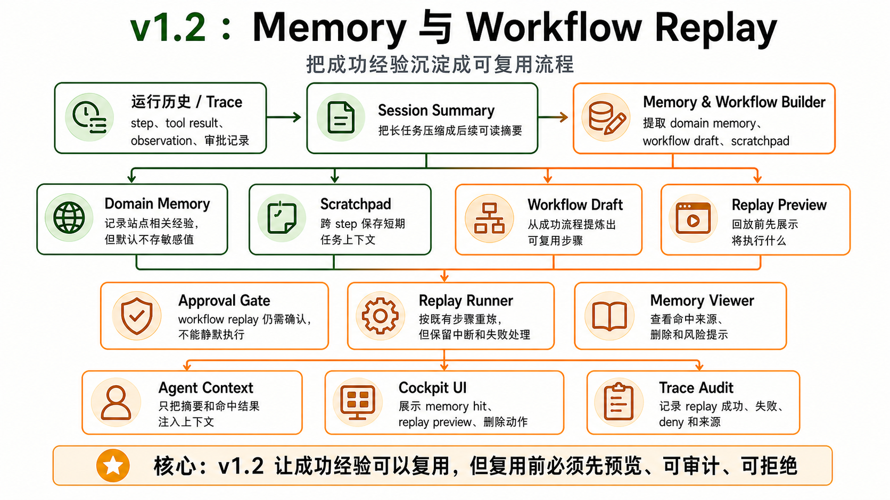

# v1.2 — Memory + Workflow Replay




## 1. 背景

v1.1 每次任务仍需要重新探索页面。用户在同一网站上常做相似操作，希望 agent 能复用成功经验。BrowserBee 的 domain workflow memory 说明“可回放工具序列”对浏览器 agent 很有价值，但必须用户可见、可控、可删除。

当前用户遇到的问题：同一网站重复任务每次都从零开始，耗时且不稳定。

现有系统限制：没有 scratchpad、domain memory、workflow memory、memory viewer、replay preview。

为什么现在要做：让 BrowserHelm 从一次性助手变成越用越熟的本地副驾。

## 2. 用户故事

US1. 作为重复使用同一后台系统的用户，我希望 agent 记住成功流程，以便下次更快完成相似任务。

US2. 当 memory 命中高风险 workflow 时，作为用户，我希望系统先展示 replay preview 并请求确认，以便避免自动执行危险动作。

US3. 作为用户，我希望查看和删除某个 domain 的 memory，以便控制隐私和错误经验。

US4. 作为 agent，我希望在长任务中把关键事实写入 scratchpad，以便上下文摘要后仍保留路径、进度和计划。

US5. 作为开发者，我希望旧 trace、旧 tool result、旧 observation 和 workflow steps 能压缩成 SessionSummary，以便长程任务和复用流程不撑爆上下文。

US6. 作为调试者，我希望能基于 trace 重放一次 agent run 的模型输出、parsed decision、tool args 和 tool result，以便定位失败原因。

## 3. 目标

本 Issue 要完成：

- 实现 scratchpad、domain memory、workflow memory。
- 实现 `bh_memory_*`、`bh_pad_*`、`bh_flow_*` 工具。
- 实现 memory lookup 注入 agent turn input。
- 实现 workflow replay preview 和 approval。
- 实现 MemoryViewer、ReplayPreview。
- 在 memory / workflow 边界稳定后，评估后续版本是否需要 agent-as-tool / sub-agent，但本版本不实现。
- 实现 StepSummary、RunSummary、SessionSummary。
- 实现 memory 写入前的 policy / secret masking。
- 实现 trace replay seed：重放模型输出、parsed decision、tool args、tool result、错误码。
- 成功 mode-based plan 可沉淀成 workflow draft。
- 复用 v1.1.2 已收口的 Prompt ABI、PromptContextPolicy、Parse Repair 和 locale bootstrap，在此基础上扩展 memory summary、workflow replay preview 与 trace replay seed。
- 落地 per-domain permission/domain policy 基础：memory/workflow/replay 只能在被允许的 domain 上命中和执行，高风险 replay 仍需 approval。
- 将 Goal/SuccessCriteria 与 StepSummary、RunSummary、SessionSummary 打通，作为 workflow draft 和 replay completion 的判断依据。
- 落地 MV3 service worker 生命周期下的 session persistence：pending approval、pending action、run generation、关键 snapshot 和 session audit 可恢复或安全失效。

### 任务拆解

- T1. 定义 Memory schema、WorkflowMemory schema。
- T2. 实现 memory-repo、workflow-repo。
- T3. 实现 scratchpad tools。
- T4. 实现 memory lookup/save/update/delete/list。
- T5. 实现 flow lookup/preview/run/score。
- T6. 实现 memory summary 注入 PromptBuilder。
- T7. 实现 ReplayPreview UI。
- T8. 实现 MemoryViewer UI。
- T9. 增加 memory privacy controls。
- T10. 实现 StepSummary / RunSummary / SessionSummary builder。
- T11. 实现 memory write policy 和 secret masking。
- T12. 实现 trace replay reader 和 replay event adapter。
- T13. 实现 plan-to-workflow draft builder。
- T14. 基于 v1.1.2 Prompt ABI 扩展 memory/workflow prompt sections，确保 memory summary 和 workflow preview 只进入 dynamic suffix。
- T15. 基于 v1.1.2 PromptContextPolicy 扩展 MemoryContextPolicy，统一约束 memory summary、workflow draft、replay frame 和 session summary 的预算与脱敏。
- T16. 实现 domain permission seed：记录 allowed/blocked domains、optional host permission state、memory/workflow domain scope 和 replay permission reason。
- T17. 实现 Goal/SuccessCriteria summary bridge：run 启动、StepSummary、RunSummary、SessionSummary 和 workflow draft 均携带 completion criteria / completion evidence。
- T18. 实现 approval/session persistence：pending approval、pending action、run snapshot summary、run generation id 和 audit event 写入 `chrome.storage.session` 或 IndexedDB，并在 worker 重启后恢复或显式过期。

## 4. 不做什么

本 Issue 明确不处理：

- 不做 team memory。
- 不做 cloud sync。
- 不做 marketplace。
- 不做跨设备共享。
- 不做自动静默 replay。
- 不做真正 sub-agent / agent-as-tool / planner-worker。

## 5. 产品方案

### 功能入口

Cockpit 中增加 Memory 区域；任务开始时 runtime 自动 lookup 当前 domain memory。

### 用户路径

任务开始 -> memory lookup -> memory hit summary 展示 -> 模型决定是否使用 -> replay preview -> 用户确认 -> runtime step-by-step replay。

### 正常状态

memory 命中时展示 domain、task、last used、success rate、tool sequence summary。

### 空状态

没有 memory 时显示“当前站点暂无可复用记忆”。

### 错误状态

memory schema 过期、workflow step 失败、locator stale、用户拒绝 replay 都必须展示明确原因。

### 权限 / 可见性

Memory 只本地保存。用户可以按 domain 删除。Replay 前必须确认，高风险步骤仍走 approval。

默认不记密码、token、验证码、支付信息、身份证、银行卡和敏感字段值。Memory 写入必须经过 policy 和 masking。

## 6. 设计图 / 视觉参考


设计来源

Figma: 不适用
截图: docs/roadmap/assets/v1.2-memory-workflow-replay-architecture.png
文档: docs/roadmap/v1.2-memory-workflow-replay.md
其他: GPT Image 2 生成架构图

设计范围

本 Issue 需要实现的设计范围：memory viewer、replay preview。

明确不需要实现的设计范围：marketplace、team memory、cloud sync。

关键视觉要求

布局: memory 命中、来源、风险、可删除性必须清晰。
文案: replay 前明确说明将执行什么。
颜色: replay 风险状态明显。
字体: 与 cockpit 一致。
间距: 适合列表和详情切换。
动效: replay step 高亮即可。
响应式: side panel 可用。

设计验收方式

是否需要截图对比: 是
是否需要浏览器 / 桌面端手动验证: 是
需要覆盖的状态: no memory、memory hit、replay preview、approval denied、replay completed。

## 7. 技术方案

### 现状

只有 trace，没有可复用 memory。

### 目标设计

Memory 存 IndexedDB。Agent turn input 只接收 memory summary，不直接塞完整 workflow。Workflow replay 由 runtime 控制，不由模型直接自由执行。本版本继续沿用单 AgentLoop；如果后续 mode / task runner 不够，再在 v1.2+ 之后单独评估 sub-agent。v1.2 同时把 v1.1.x 的内存 run/approval 状态升级为 MV3 生命周期友好的 session persistence，避免 service worker 回收后出现审批卡、pending action 和 run snapshot 不一致。

Domain permission 基础固定为：

- Memory、workflow 和 replay 均以 domain/origin 为作用域。
- 未授权 domain 不注入 memory summary，不展示 replay shortcut，不执行 workflow replay。
- optional host permission state 进入 capability summary，但不进入 stable tool contract prefix。
- 高风险 workflow replay 必须 preview + approval，adapter/memory 命中不能绕过 PolicyEngine。


MV3 session persistence 固定为：

- pending approval 和 pending action 必须有 run generation id、createdAt、expiresAt 和 tab/frame identity。
- service worker 重启后，未过期且上下文可验证的 approval 可以恢复；无法验证时必须安全过期，不得继续执行动作。
- run snapshot summary 和 audit event 至少 session 级持久化；完整 trace 持久化继续服务 v1.2 trace replay seed。
- workflow replay step 执行前必须检查当前 run generation，避免旧 approval 执行新页面动作。

Goal/SuccessCriteria 在 v1.2 产品化为 summary/replay 可用的完成依据：

- Run 启动时可携带用户目标和 success criteria。
- StepSummary 记录本 step 对目标的贡献。
- RunSummary 记录 outcome、completionEvidence 和 unmetCriteria。
- SessionSummary 记录跨轮目标、已确认动作和下次继续提示。
- Workflow draft 只能从 completionEvidence 足够的成功 run 中生成。

摘要链路固定为：

```txt
ToolResult full data -> Trace
StepSummary -> Context
RunSummary -> Memory
SessionSummary -> Old session / workflow reuse
```

AgentLoop prompt/context hardening 在 v1.1.2 先落地，v1.2 复用并扩展为 memory/workflow 可用的 Prompt ABI：

```txt
Stable prefix:
  base system policy
  browser/runtime/safety/approval policy
  output decision schema
  available tools contract manifest

Dynamic suffix:
  locale preference
  current task
  selected memory summaries
  scratchpad
  bounded history / trace summaries
  bounded page observation / structured page data
  last tool result summary
  runtime hints
```

KV Cache 约束：

- stable prefix 在同一 BrowserHelm 版本、locale、run mode 和 tool manifest hash 下必须保持字节级稳定。
- tool contract manifest 按工具名排序，包含 name、description、args JSON schema、risk、readOnly、requiresApproval、modes 和 context visibility，不包含当前页面状态、用户任务、字段值或 memory 命中。
- dynamic suffix 才允许包含 task、page state、history、trace、memory、tool result 和 runtime hints。
- 当工具集变化时记录 `toolManifestHash`，让 trace/replay 可以解释 KV cache miss 和模型决策差异。

PromptContextPolicy 固定预算层级：

```txt
raw observation / structured data / tool result / trace
  -> redaction
  -> typed summary builder
  -> per-section budget
  -> total prompt budget
  -> provider messages
```

默认策略：

- observation：只注入标题、URL、可见文本摘要、关键 a11y/ref highlights、warnings，不注入完整 DOM 或完整 ref map。
- structured page data：按当前 mode 选择相关类别，限制 form fields / interactive elements 数量，并保留 omitted count。
- tool result：模型上下文只接收 code、summary、nextHints、changedPage、requiresObserve 和显式 context.summary；完整 data 仅进入 trace/storage。
- history/trace：保留用户可读对话摘要和最近关键事件摘要，不递归塞入完整 JSONL。
- memory：只注入 memory summary / workflow preview，不注入完整 workflow 原始 payload。
- redaction：用户任务、tool args、tool result、model raw output、finalPreview、trace payload 在进入 provider 或持久 trace 前统一经过敏感值脱敏。

Parse repair 在 v1.1.2 固定为一次性恢复，v1.2 trace replay seed 必须能够重放 repair 前后的模型输出与 parsed decision：

- 首次模型输出 JSON parse 或 decision schema 校验失败时，runtime 记录脱敏后的 `decision_parse_failed`。
- repair 请求只包含稳定输出格式、当前 allowed decisions/tools、错误摘要和截断脱敏 raw output。
- repair 最多一次；再次失败进入 `failed` 或 `waiting_for_user`，不得循环请求模型。
- repair 不得放宽 mode/tool/policy/approval 限制，只能把非法输出改写成当前允许的 terminal decision 或 tool call。

i18n locale bootstrap 在 v1.1.2 修复，v1.2 memory/replay UI 沿用同一 locale 单源：

- Chrome storage 是 locale 单一持久源。
- localStorage 仅用于旧版本迁移和无 Chrome storage 环境 fallback，不再作为并行真源。
- I18nProvider 必须监听异步初始 locale 更新，避免启动后仍停留在默认语言。
- 模型 prompt 的 dynamic suffix 包含用户语言偏好；内部 trace code 保持稳定英文枚举，用户可见 summary 通过 i18n key 渲染。

Trace replay seed 固定读取：

```txt
raw model output
parsed decision
tool args
tool result
timestamps
error codes
```

成功 plan 可以生成 workflow draft，但必须先进入 replay preview / approval，不允许静默保存为自动执行 workflow。

### 数据流 / 调用链

observe domain -> memory lookup -> memory summary -> model decision -> flow preview -> approval -> flow runner -> per-step tool execution -> trace/memory score update。

### 关键类型 / API

```ts
type WorkflowMemory = {
  id: string;
  domain: string;
  intent: string;
  taskDescription: string;
  toolSequence: ToolCall[];
  locators: ElementLocator[];
  successCount: number;
  failureCount: number;
  lastUsedAt: number;
};

type StepSummary = {
  stepId: string;
  tool?: string;
  outcome: 'success' | 'failed' | 'skipped';
  summary: string;
  nextHints?: string[];
};

type RunSummary = {
  runId: string;
  task: string;
  outcome: 'success' | 'failed' | 'cancelled';
  keyFindings: string[];
  reusableSteps: StepSummary[];
  failureReason?: string;
};

type SessionSummary = {
  sessionId: string;
  domain?: string;
  taskGoal: string;
  importantPageState: string[];
  confirmedActions: string[];
  reusableLocators: string[];
  nextTimeHints: string[];
};

type TraceReplayFrame = {
  traceEventId: string;
  kind: 'model_output' | 'parsed_decision' | 'tool_call' | 'tool_result' | 'error';
  summary: string;
  payloadRef?: string;
};
```

### 错误处理

Replay 中任何 ref stale 或 tool failure 都暂停 replay，返回给模型重新观察，不继续盲跑。

### 子 Agent 评估条件

只有同时满足以下条件时，后续版本才考虑 sub-agent / agent-as-tool：

- ToolResult、Trace、ContextCompaction、Approval 和 Memory / Workflow 边界已经稳定。
- 任务天然可拆成独立子任务，且子任务需要独立上下文窗口。
- 子任务失败不应该污染主 agent 的上下文。
- 子任务有不同工具权限或不同 context policy。
- 子任务能产出压缩报告给主 agent，而不是把完整 trace 塞回主上下文。

### 复用与约束

优先复用：ToolCall、ToolResult、Approval、TraceEvent。

不要重复实现：tool executor、risk classifier、trace writer。

## 8. 目录结构

```txt
src/agent/memory/
├── memory-context-builder.ts
├── memory-hit-ranker.ts
├── memory-summary-builder.ts
├── step-summary-builder.ts
├── run-summary-builder.ts
├── session-summary-builder.ts
├── scratchpad-context.ts
├── workflow-replay-planner.ts
├── workflow-replay-runner.ts
└── plan-to-workflow-draft.ts

src/memory/
├── scratchpad/
├── domain/
├── workflow/
├── preference/
└── session-summary/

src/eval/replay/
├── trace-replay-reader.ts
└── replay-event-adapter.ts

src/agent/prompts/
├── memory-policy-prompt.ts
└── workflow-replay-policy-prompt.ts

src/tools/memory/
├── bh-memory-lookup.ts
├── bh-memory-save.ts
├── bh-memory-update.ts
├── bh-memory-delete.ts
├── bh-memory-list.ts
├── bh-memory-clear-domain.ts
├── bh-memory-clear-all.ts
└── bh-memory-explain-hit.ts

src/tools/pad/
├── bh-pad-read.ts
├── bh-pad-append.ts
├── bh-pad-replace.ts
├── bh-pad-clear.ts
└── bh-pad-compact.ts

src/tools/workflow/
├── bh-flow-lookup.ts
├── bh-flow-preview.ts
├── bh-flow-run-with-approval.ts
├── bh-flow-step.ts
├── bh-flow-stop.ts
├── bh-flow-save.ts
├── bh-flow-update.ts
├── bh-flow-delete.ts
└── bh-flow-score.ts

src/storage/
├── memory-repo.ts
├── scratchpad-repo.ts
├── workflow-repo.ts
└── migrations/
    ├── 001-create-memory-stores.ts
    └── 002-create-workflow-stores.ts

src/shared/schemas/
├── memory.ts
├── scratchpad.ts
├── workflow.ts
└── workflow-replay.ts

src/ui/components/
├── MemoryViewer.tsx
├── MemoryHitCard.tsx
├── MemoryDetail.tsx
├── ScratchpadPanel.tsx
├── ReplayPreview.tsx
└── ReplayStepList.tsx

tests/node/agent/memory/
├── memory-context-builder.test.ts
├── memory-hit-ranker.test.ts
├── memory-summary-builder.test.ts
├── step-summary-builder.test.ts
├── run-summary-builder.test.ts
├── session-summary-builder.test.ts
├── workflow-replay-planner.test.ts
├── workflow-replay-runner.test.ts
└── plan-to-workflow-draft.test.ts

tests/node/eval/replay/
├── trace-replay-reader.test.ts
└── replay-event-adapter.test.ts

tests/node/tools/
├── memory-tools.test.ts
├── pad-tools.test.ts
└── workflow-tools.test.ts

tests/node/storage/
├── memory-repo.test.ts
├── scratchpad-repo.test.ts
└── workflow-repo.test.ts

tests/node/shared/schemas/
├── memory.test.ts
├── scratchpad.test.ts
└── workflow.test.ts

tests/dom/ui/
├── MemoryViewer.test.tsx
├── ScratchpadPanel.test.tsx
└── ReplayPreview.test.tsx

tests/node/integration/agent-tools/
├── memory-context-injection.test.ts
├── workflow-replay-approval.test.ts
└── workflow-replay-stop.test.ts

tests/fixtures/
├── memories/
├── workflows/
└── replay-traces/

tests/helpers/
├── memory-store-fixture.ts
└── workflow-fixture.ts
```

## 9. 依赖关系

前置依赖：

- v1.1 Assisted Form Fill + Frontend Debug

后续依赖：

- v1.6 Domain Adapters
- v2.0 Platform

## 10. 验收标准

AC1. 覆盖 US1：当同一 domain 存在相似成功流程时，系统会展示 memory hit 并允许用户确认复用。

AC2. 覆盖 US2：workflow replay 前必须展示 replay preview，并要求用户确认。

AC3. 覆盖 US3：用户可以查看、删除 domain memory，并且删除后不再命中。

AC4. 覆盖 US4：长任务可以写入 scratchpad，并在后续 turn 中读取摘要。

AC5. 覆盖 US5：旧 trace、tool result、observation 和 workflow steps 能生成 SessionSummary，并以摘要形式注入上下文。

AC6. 覆盖 US6：trace replay reader 能读取模型输出、parsed decision、tool args、tool result、timestamps 和错误码。

AC7. 成功 plan 可以生成 workflow draft，进入 replay preview / approval，而不是静默保存为可执行 workflow。

AC8. 本版本不新增 sub-agent 决策类型；memory 和 workflow 只以 summary / replay runner 形式接入单 AgentLoop。

AC9. memory 默认不保存密码、token、验证码、支付信息、身份证、银行卡和敏感字段值。

AC10. 已有 v1.0/v1.1 行为不受影响。

AC11. 实际改动不超出「改动目录结构」；如必须超出，PR 需要写偏离说明。

AC12. 如涉及设计图，实现结果符合「设计图 / 视觉参考」中列出的范围和关键视觉要求。
