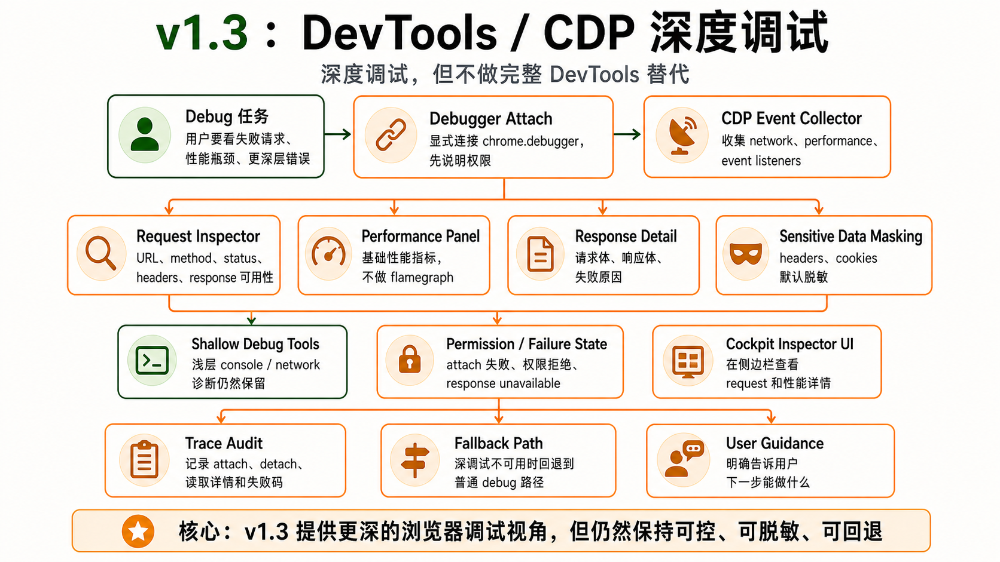

# v1.3 — DevTools/CDP Deep Tools




## 1. 背景

v1.0 和 v1.1 的 debug 能力主要来自页面脚本可见的 console/network 摘要，无法深入 request body、response body、performance、event listeners 和 CDP target。前端开发者需要更接近 DevTools 的诊断能力。

当前用户遇到的问题：接口失败后只能看到浅层摘要，无法查看响应体、详细 headers、性能指标和事件监听。

现有系统限制：没有 chrome.debugger manager，没有 CDP tool family，没有 request inspector UI。

为什么现在要做：让 BrowserHelm 成为真正的前端调试 agent。

## 2. 用户故事

US1. 作为前端开发者，我希望 agent 能读取失败请求的详情和响应，以便定位接口或 CORS 问题。

US2. 当 debugger 权限未授予或 attach 失败时，作为用户，我希望系统清楚解释原因，以便决定是否开启权限。

US3. 作为前端开发者，我希望 agent 能查看 performance metrics，以便发现页面加载或交互瓶颈。

US4. 作为开发者，我希望敏感 headers/cookies 默认 mask，以便 trace 可分享时不泄露隐私。

## 3. 目标

本 Issue 要完成：

- 实现 chrome.debugger attach/detach。
- 实现 CDP console/network/request detail/response body/performance/event listener 工具。
- 实现 RequestInspector、PerformancePanel、ConsoleEventPanel。
- 明确 debugger 权限说明和脱敏策略。
- 承接完整 CDP debug 平台规划：v1.1.x 只保留浅层 debug，本版本集中完成深度 request/response/performance/event inspector。
- 将 page-health hook 从默认主世界 monkey patch 收敛为按需 debug capability，并用 CDP network/console collector 替代能替代的浅层 hook 场景。

### 任务拆解

- T1. 实现 debugger-manager。
- T2. 实现 bh_cdp_attach / detach。
- T3. 实现 network events collector。
- T4. 实现 request detail / response body tools。
- T5. 实现 performance metrics tool。
- T6. 实现 event listeners tool。
- T7. 实现 request inspector UI。
- T8. 实现 sensitive headers masking。
- T9. 更新 security 文档。
- T10. 建立 CDP debug regression：attach/detach、response body unavailable、headers/cookies redaction、permission denied、shallow debug fallback。
- T11. 重构 page-health hook：默认关闭或仅 Debug mode opt-in 注入，URL/query/path/fragment 在 postMessage 前脱敏，UI 明确提示临时诊断 hook。

## 4. 不做什么

本 Issue 暂不处理，后续可重新评估：

- 不做完整 DevTools 替代品。
- 不做 source editor。
- 不做复杂 profiler flamegraph。
- 不做远程浏览器调试。

## 5. 产品方案

### 功能入口

DebugPanel 中增加 Deep Inspect / Attach Debugger 入口。

### 用户路径

用户请求深入检查 -> 系统说明 debugger 权限 -> attach -> 收集 CDP events -> 用户选择 request/error -> inspector 展示详情 -> detach。

### 正常状态

显示 debugger attached 状态、request list、selected request detail、response availability、performance metrics。

### 空状态

没有 network events 时提示“尚未捕获请求，可刷新页面后重试”。

### 错误状态

attach 失败、response body 不可用、权限被拒绝、tab 不支持 debugger 都要明确展示。

### 权限 / 可见性

debugger 权限必须明确说明。Headers/cookies 默认脱敏。

## 6. 设计图 / 视觉参考


设计来源

Figma: 不适用
截图: docs/roadmap/assets/v1.3-devtools-cdp-architecture.png
文档: docs/roadmap/v1.3-devtools-cdp.md
其他: GPT Image 2 生成架构图

设计范围

本 Issue 需要实现的设计范围：request inspector、performance panel。

暂不需要实现的设计范围，后续可重新评估：full DevTools replacement、source editor、profiler flamegraph。

关键视觉要求

布局: request detail 与 summary 分区明确。
文案: 权限和 debugger attach 状态必须明确。
颜色: network status/error 颜色清晰。
字体: 等宽字体用于 request/response/code。
间距: 高密度但可读。
动效: attach/detach 状态轻量反馈。
响应式: side panel 可用。

设计验收方式

是否需要截图对比: 是
是否需要浏览器 / 桌面端手动验证: 是
需要覆盖的状态: debugger detached、attached、request selected、response unavailable、permission denied。

## 7. 技术方案

### 现状

只有浅层 debug tools。

### 目标设计

background/debugger-manager 封装 chrome.debugger；CDP tools 经 ToolRouter 调用；敏感 headers/cookies 默认 mask。page-health hook 降级为 opt-in shallow fallback：只有在 CDP 不可用或用户选择浅层诊断时才注入，并且注入前后都要有 UI/trace 标记。

### 数据流 / 调用链

DebugPanel -> bh_cdp_attach -> debugger-manager -> collect events -> bh_cdp_get_request_detail -> UI inspector。

### 关键类型 / API

```ts
type NetworkRequestRecord = {
  requestId: string;
  url: string;
  method: string;
  status?: number;
  failed?: boolean;
  errorText?: string;
  requestHeadersPreview: Record<string, string>;
  responseHeadersPreview?: Record<string, string>;
};
```

### 错误处理

CDP attach 失败不影响 v1.0/v1.1 debug tools。Response body unavailable 要返回明确 reason。

### 复用与约束

优先复用：secret masker、DebugPanel、TraceEvent。

不要重复实现：network summary 逻辑、approval policy。

## 8. 目录结构

```txt
src/background/debugger/
├── debugger-manager.ts
├── cdp-session.ts
├── cdp-event-buffer.ts
├── network-event-store.ts
├── console-event-store.ts
└── performance-store.ts

src/tools/cdp/
├── bh-cdp-attach.ts
├── bh-cdp-detach.ts
├── bh-cdp-get-targets.ts
├── bh-cdp-get-console-events.ts
├── bh-cdp-get-network-events.ts
├── bh-cdp-get-request-detail.ts
├── bh-cdp-get-response-body.ts
├── bh-cdp-get-performance-metrics.ts
├── bh-cdp-get-event-listeners.ts
└── bh-cdp-capture-dom-snapshot.ts

src/ui/components/
├── RequestInspector.tsx
├── PerformancePanel.tsx
└── ConsoleEventPanel.tsx

src/shared/schemas/
├── cdp-event.ts
└── network-request.ts

tests/node/background/debugger/
├── debugger-manager.test.ts
├── cdp-session.test.ts
├── cdp-event-buffer.test.ts
└── network-event-store.test.ts

tests/node/tools/cdp/
├── attach-detach.test.ts
├── console-events.test.ts
├── network-events.test.ts
├── request-detail.test.ts
└── response-body.test.ts

tests/node/shared/schemas/
├── cdp-event.test.ts
└── network-request.test.ts

tests/dom/ui/
├── RequestInspector.test.tsx
├── PerformancePanel.test.tsx
└── ConsoleEventPanel.test.tsx

tests/browser/extension/background-debugger/
├── cdp-attach-failure.test.ts
├── network-detail-flow.test.ts
└── response-body-unavailable.test.ts

tests/fixtures/cdp/
├── console-events.json
├── network-events.json
└── performance-metrics.json

tests/helpers/
├── mock-cdp-client.ts
└── cdp-event-builder.ts
```

## 9. 依赖关系

前置依赖：

- v1.1 Assisted Form Fill + Frontend Debug

后续依赖：

- v1.4 Vision/Screenshot Agent
- v1.5 Advanced Browser Tools

## 10. 验收标准

AC1. 覆盖 US1：当用户检查失败请求时，系统会展示 request detail、status、headers 摘要和可用 response body。

AC2. 覆盖 US2：当 debugger attach 失败时，UI 展示原因和可操作建议。

AC3. 覆盖 US3：PerformancePanel 展示基础 performance metrics。

AC4. 覆盖 US4：敏感 headers/cookies 在 UI 和 trace 中默认 mask。

AC5. 已有 v1.0/v1.1 shallow debug tools 不受影响。

AC6. 实际改动不超出「改动目录结构」；如必须超出，PR 需要写偏离说明。

AC7. 如涉及设计图，实现结果符合「设计图 / 视觉参考」中列出的范围和关键视觉要求。
