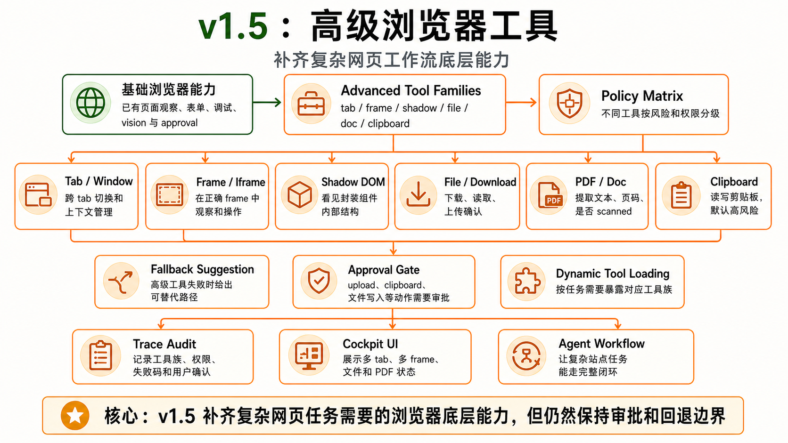

# v1.5 — Advanced Browser Tools




## 1. 背景

完整版浏览器 Agent 需要处理多 tab、iframe、shadow DOM、下载、上传、PDF、剪贴板和复杂页面边界。现有版本聚焦单页表单/调试，无法覆盖复杂工作流。

当前用户遇到的问题：复杂网站经常涉及新 tab、跨域 iframe、shadow DOM 控件、文件上传下载、PDF 阅读和剪贴板操作。

现有系统限制：工具面不足，无法执行复杂浏览器任务。

为什么现在要做：补齐全量浏览器 Agent 的关键底层能力。

## 2. 用户故事

US1. 作为高级用户，我希望 agent 能跨 tab、iframe 和 shadow DOM 操作，以便完成复杂网站任务。

US2. 当工具涉及上传、剪贴板、execute JS 或文件系统风险时，作为用户，我希望系统请求确认并记录 trace，以便掌控风险。

US3. 作为用户，我希望 agent 能读取 PDF 和下载文件摘要，以便处理文档型网页任务。

US4. 当某个高级工具不可用时，作为用户，我希望系统说明限制并回退可用路径。

## 3. 目标

本 Issue 要完成：

- 实现 tab/frame/shadow/file/doc/clipboard 工具。
- 实现下载列表、PDF 文本抽取、上传 approval。
- 完善工具动态裁剪和风险等级。
- 完善 Advanced mode tool policy。

### 任务拆解

- T1. 实现 tab-manager 与 tab tools。
- T2. 实现 frame tools。
- T3. 实现 shadow DOM tools。
- T4. 实现 download-manager 与 file tools。
- T5. 实现 PDF/doc tools。
- T6. 实现 clipboard tools。
- T7. 更新 policy risk matrix。
- T8. 更新 tool dynamic loading。

## 4. 不做什么

本 Issue 明确不处理：

- 不做 domain adapters。
- 不做 marketplace。
- 不做云端文件同步。
- 不做绕过验证码或反爬机制。
- 不做 native desktop app 自动化。

## 5. 产品方案

### 功能入口

Agent 根据任务自动进入 Advanced mode；用户也可以在设置中开启高级工具。

### 用户路径

任务需要高级能力 -> Agent 请求启用对应 tool family -> 风险动作 approval -> 执行 -> trace 记录。

### 正常状态

能列出 tabs、读取 frames、处理 shadow DOM、下载/读取文件、读取 PDF、写剪贴板。

### 空状态

没有下载文件、没有 iframe、没有 shadow root、PDF 无可抽取文本时显示明确空状态。

### 错误状态

跨域限制、文件不可读、PDF scanned、剪贴板权限拒绝、上传取消都要有结构化错误。

### 权限 / 可见性

upload、clipboard read/write、execute runtime、清理数据都需要 approval。

## 6. 设计图 / 视觉参考


设计来源

Figma: 不适用
截图: docs/roadmap/assets/v1.5-advanced-browser-tools-architecture.png
文档: docs/roadmap/v1.5-advanced-browser-tools.md
其他: GPT Image 2 生成架构图

设计范围

本 Issue 需要实现的设计范围：tab / frame / shadow / file / doc / clipboard 六类高级工具、approval gate、dynamic tool loading、fallback suggestion 与 Cockpit 可见性。

明确不需要实现的设计范围：domain adapters、marketplace、云端文件同步、验证码绕过、原生桌面应用自动化。

关键视觉要求

布局: 先表现 advanced tool families，再表现 policy matrix、approval gate、fallback 和 UI/trace 承载。
文案: 要让用户明白这些是“复杂网页工作流底层能力”，不是默认全开工具。
颜色: 橙色为主，体现权限与风险较高；绿色只用于已有基础能力起点。
字体: 中文优先，tab / frame / shadow / file / clipboard 等术语可保留英文。
间距: 多工具族并列时仍要保持清晰可扫读。
动效: 不要求。
响应式: 不适用。

设计验收方式

是否需要截图对比: 是
是否需要浏览器 / 桌面端手动验证: 否
需要覆盖的状态: tab/frame/shadow、file/pdf、clipboard、approval required、fallback。

## 7. 技术方案

### 现状

缺少高级 browser tool families。

### 目标设计

background 处理 tab/download/file，content 处理 frame/shadow，doc tools 处理 PDF/text extraction，policy 处理高风险工具。

### 数据流 / 调用链

Agent -> ToolRouter -> advanced tool family -> background/content manager -> ToolResult -> trace。

### 关键类型 / API

```ts
type AdvancedToolMode = 'tab' | 'frame' | 'shadow' | 'file' | 'doc' | 'clipboard';
```

### 错误处理

高级工具失败必须提供 fallback suggestion，不允许让 agent 重复同一失败动作。

### 复用与约束

优先复用：approval policy、trace、tool dynamic clipping。

不要重复实现：基础 click/type/page observe。

## 8. 目录结构

```txt
src/tools/tab/
src/tools/frame/
src/tools/shadow/
src/tools/file/
src/tools/doc/
src/tools/clipboard/
src/background/tab-manager.ts
src/background/download-manager.ts
src/shared/schemas/file.ts
src/shared/schemas/frame.ts
src/shared/schemas/document.ts

tests/node/tools/
├── tab-tools.test.ts
├── frame-tools.test.ts
├── shadow-tools.test.ts
├── file-tools.test.ts
├── doc-tools.test.ts
└── clipboard-tools.test.ts

tests/node/background/
├── tab-manager.test.ts
└── download-manager.test.ts

tests/node/shared/schemas/
├── file.test.ts
├── frame.test.ts
└── document.test.ts

tests/node/integration/agent-tools/
├── multi-tab-flow.test.ts
├── iframe-ref-resolution.test.ts
├── shadow-dom-action.test.ts
├── download-flow.test.ts
└── clipboard-approval.test.ts

tests/fixtures/
├── pages/
├── documents/
└── downloads/

tests/helpers/
├── tab-fixture.ts
└── file-fixture.ts
```

## 9. 依赖关系

前置依赖：

- v1.1 Assisted Form Fill + Frontend Debug
- v1.3 DevTools/CDP
- v1.4 Vision/Screenshot Agent

后续依赖：

- v1.6 Domain Adapters
- v2.0 Platform

## 10. 验收标准

AC1. 覆盖 US1：当用户任务跨 tab 或 iframe 时，系统会列出上下文并在正确目标中执行读写动作。

AC2. 覆盖 US2：上传、剪贴板、文件相关敏感动作必须 approval 并写入 trace。

AC3. 覆盖 US3：PDF/doc tools 能返回文本、页码范围、是否 scanned、是否 truncated。

AC4. 覆盖 US4：高级工具不可用时，系统展示明确限制和 fallback。

AC5. 已有 v1.1/v1.3/v1.4 行为不受影响。

AC6. 实际改动不超出「改动目录结构」；如必须超出，PR 需要写偏离说明。

AC7. 设计图验收通过条件：roadmap 内嵌图片与第 6 节范围一致，能够清楚展示高级工具族、审批门禁和失败回退路径。
