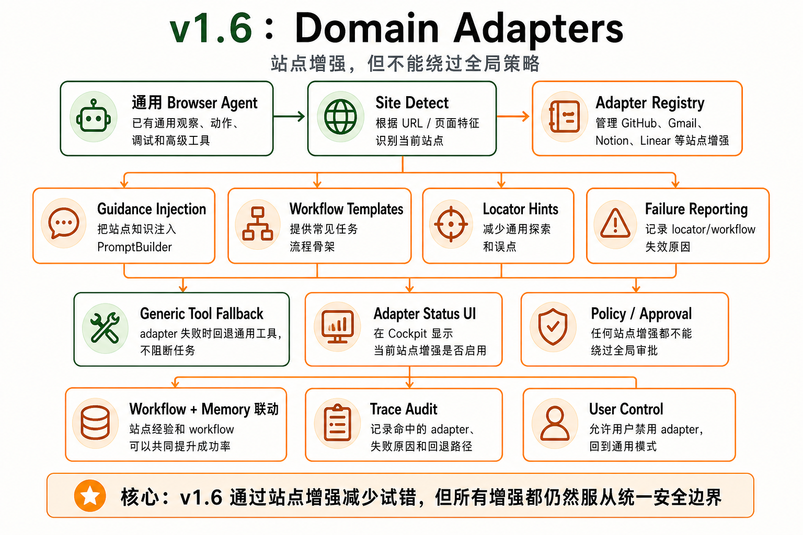

# v1.6 — Domain Adapters




## 1. 背景

通用 browser agent 在复杂网站上会重复探索、误点或不了解站点惯例。高价值站点需要专门的提示、locator、workflow 和风险规则。

当前用户遇到的问题：GitHub、Gmail、Notion、Linear、Jira、Stripe、Vercel、Supabase 等网站流程复杂，通用工具虽然能做但步数多、失败率高。

现有系统限制：没有 site-specific guidance、known workflow、known locator 和 adapter failure reporting。

为什么现在要做：显著提升高价值网站成功率。

## 2. 用户故事

US1. 作为高频使用特定网站的用户，我希望 agent 知道该网站的常见流程，以便更快更稳完成任务。

US2. 当 adapter 的 locator 或 workflow 失败时，作为开发者，我希望系统记录失败并回退通用工具，以便持续改进 adapter。

US3. 作为用户，我希望知道当前是否启用了站点 adapter，以便理解 agent 为什么更有把握。

US4. 作为安全敏感用户，我希望 adapter 不能绕过全局 approval policy，以便站点定制不会降低安全性。

## 3. 目标

本 Issue 要完成：

- 实现 adapter registry。
- 实现 site detection、guidance、workflows、locators、failure reporting。
- 首批 adapters：GitHub、Gmail、Notion、Linear、Jira、Stripe、Vercel、Supabase。
- 将 adapter guidance 接入 PromptBuilder。

### 任务拆解

- T1. 定义 adapter interface。
- T2. 实现 adapter registry。
- T3. 实现 bh_adapter_detect_site。
- T4. 实现 guidance injection。
- T5. 实现 workflow listing。
- T6. 实现 locator application。
- T7. 实现 failure reporting。
- T8. 创建首批 adapters skeleton。
- T9. 更新 UI 展示 adapter 状态。

## 4. 不做什么

本 Issue 明确不处理：

- 不做第三方 adapter marketplace。
- 不做云端 adapter 更新。
- 不做 enterprise policy。
- 不做站点私有 API 调用优先策略。

## 5. 产品方案

### 功能入口

Agent 进入目标站点后自动 detect site，并在 cockpit 展示 adapter 状态。

### 用户路径

访问支持站点 -> adapter detected -> guidance 注入 -> workflow/memory 可用 -> agent 使用站点增强策略 -> 失败时回退通用工具。

### 正常状态

显示当前站点 adapter 名称、可用 workflows、启用状态。

### 空状态

不支持站点时显示“使用通用 browser tools”。

### 错误状态

adapter locator 失败、workflow 不匹配、站点版本变化都要记录 failure report。

### 权限 / 可见性

adapter 不能绕过全局 approval policy。用户可以禁用 adapter。

## 6. 设计图 / 视觉参考


设计来源

Figma: 不适用
截图: docs/roadmap/assets/v1.6-domain-adapters-architecture.png
文档: docs/roadmap/v1.6-domain-adapters.md
其他: GPT Image 2 生成架构图

设计范围

本 Issue 需要实现的设计范围：site detect、adapter registry、guidance injection、workflow templates、locator hints、failure reporting、generic tool fallback、adapter status UI 与 policy / approval 边界。

明确不需要实现的设计范围：第三方 adapter marketplace、云端 adapter 更新、enterprise policy、优先走站点私有 API。

关键视觉要求

布局: 先表现通用 agent 与 site detect，再表现 adapter registry 和 guidance/workflow/locator 能力，最后表达 fallback 与 policy。
文案: 明确强调“站点增强，但不能绕过全局策略”。
颜色: 绿色表示通用路径与 fallback，橙色表示 adapter 增强、状态和审计边界。
字体: 中文清晰可读，GitHub / Gmail / Notion 等站点名只作为点缀，不喧宾夺主。
间距: 适合 roadmap 文档系列图统一阅读。
动效: 不要求。
响应式: 不适用。

设计验收方式

是否需要截图对比: 是
是否需要浏览器 / 桌面端手动验证: 否
需要覆盖的状态: adapter detected、guidance injected、adapter failure、generic fallback、approval enforced。

## 7. 技术方案

### 现状

已有 `DomainAdapter` skeleton、registry、adapter tools、Cockpit 状态入口和首批 8 个站点的 guidance/workflow/locator hint；当前仍缺版本化、drift detection、fixture 级 locator/workflow 验证和失败可见性闭环。

### 目标设计

保留产品概念 `DomainAdapter`，但它是非执行型站点增强，而不是站点私有执行器。adapters 只提供 guidance、locator hint、workflow template、failure report 和 policy composition 证据，不直接执行页面动作；ToolRouter、AuthorizationService、ApprovalCoordinator 和 verifier 仍然统一负责真实执行、安全审批与完成判断。

`DomainAdapter` 必须逐步补齐以下 runtime 行为，才可计为完整 v1.6 能力：versioning、locator verification、drift detection、failure reporting、policy composition。

### 数据流 / 调用链

observe URL -> adapter detect -> guidance/workflows -> PromptBuilder -> Agent decision -> ToolRouter -> failure report if needed。

### 关键类型 / API

```ts
interface DomainAdapter {
  id: string;
  matches(url: string): boolean;
  getGuidance(ctx: AdapterContext): AdapterGuidance;
  listWorkflows(ctx: AdapterContext): WorkflowTemplate[];
}

const DOMAIN_ADAPTER_RUNTIME_CONTRACT = {
  productConcept: 'DomainAdapter',
  executionModel: 'non_executing_hints',
  genericFallback: 'generic_browser_tools',
  approvalPolicy: 'global_policy_always_enforced',
  requiredRuntimeBehaviors: [
    'versioning',
    'locator_verification',
    'drift_detection',
    'failure_reporting',
    'policy_composition'
  ]
};
```

### 错误处理

adapter failure 不阻断通用工具。失败要记录 domain、workflow、locator、error code。

### 复用与约束

优先复用：workflow memory、tool registry、policy。

不要重复实现：工具执行逻辑、approval policy。

## 8. 目录结构

```txt
src/adapters/registry.ts
src/adapters/adapter-types.ts
src/adapters/github/
src/adapters/gmail/
src/adapters/notion/
src/adapters/linear/
src/adapters/jira/
src/adapters/stripe/
src/adapters/vercel/
src/adapters/supabase/
src/tools/adapter/

tests/node/adapters/
├── registry.test.ts
├── adapter-types.test.ts
├── github-adapter.test.ts
├── gmail-adapter.test.ts
├── notion-adapter.test.ts
├── linear-adapter.test.ts
├── jira-adapter.test.ts
├── stripe-adapter.test.ts
├── vercel-adapter.test.ts
└── supabase-adapter.test.ts

tests/node/tools/adapter/
└── adapter-tools.test.ts

tests/node/integration/adapters/
├── adapter-dispatch.test.ts
├── adapter-failure-fallback.test.ts
└── adapter-workflow-memory.test.ts

tests/fixtures/adapters/
├── github/
├── gmail/
├── notion/
├── linear/
├── jira/
├── stripe/
├── vercel/
└── supabase/

tests/helpers/
└── adapter-fixture.ts
```

## 9. 依赖关系

前置依赖：

- v1.2 Memory + Workflow Replay
- v1.5 Advanced Browser Tools

后续依赖：

- v2.0 Platform

## 10. 验收标准

AC1. 覆盖 US1：当用户在受支持站点发起任务时，系统会检测站点并加载对应 guidance/workflow。

AC2. 覆盖 US2：当 adapter locator 或 workflow 失败时，系统记录 failure report 并回退通用工具。

AC3. 覆盖 US3：Cockpit 显示当前 adapter 启用状态。

AC4. 覆盖 US4：adapter workflow 中的高风险动作仍然触发 approval。

AC5. 已有 generic browser tools 不受影响。

AC6. 实际改动不超出「改动目录结构」；如必须超出，PR 需要写偏离说明。

AC7. 设计图验收通过条件：roadmap 内嵌图片与第 6 节范围一致，能够清楚表达 detect -> registry -> guidance/workflow -> fallback -> policy 的主链路。
