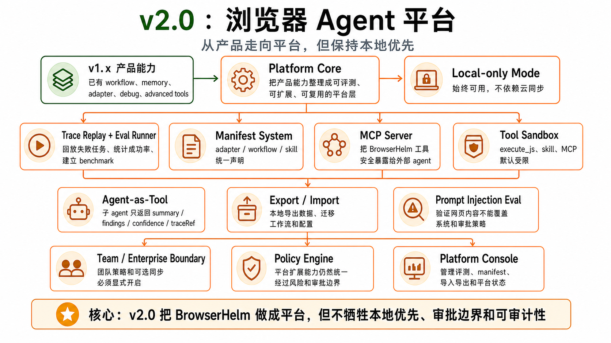

# v2.0 — Full Browser Agent Platform




## 1. 背景

v1.x 已形成强产品能力，但要成为平台，需要 eval、prompt injection eval、trace replay、skill/MCP、tool sandbox、adapter/workflow 扩展、agent-as-tool、多 agent、团队/企业策略和可选同步能力。BrowserHelm 的平台化必须保持 local-only mode，不让云能力反向绑架核心产品。

当前用户遇到的问题：单机产品难以规模化管理 workflows/adapters，也难以系统性评估 agent 成功率。

现有系统限制：没有 eval runner、trace replay、adapter/workflow manifest、export/import、team policy。

为什么现在要做：从产品走向平台，并支持团队和生态扩展。

## 2. 用户故事

US1. 作为团队用户，我希望能管理 workflow、adapter、policy 和 trace，以便在组织内安全复用浏览器自动化能力。

US2. 当某次 agent 失败时，作为开发者，我希望能 replay trace 并标注失败原因，以便系统性提升成功率。

US3. 作为隐私敏感用户，我希望 local-only mode 始终可用，以便不依赖云同步。

US4. 作为平台开发者，我希望 adapter/workflow/skill 有 manifest，以便未来支持扩展生态。

US5. 作为外部工具使用者，我希望 BrowserHelm 能以 MCP server 形式暴露安全的浏览器工具，以便外部 agent 调用但不能绕过 policy。

US6. 作为高级用户，我希望子 agent 只能以 agent-as-tool 的形式接入，并且只把 summary 返回主 agent，以便避免上下文爆炸。

US7. 作为安全测试者，我希望有 prompt injection eval cases，验证网页内容不能覆盖系统指令、工具策略或 approval policy。

US8. 作为安全架构师，我希望 execute_js、MCP、skill 这类外部或危险工具默认处在 sandbox / approval policy 下。

## 3. 目标

本 Issue 要完成：

- 实现 eval runner、trace replay、benchmark cases。
- 实现 prompt injection eval cases。
- 实现 adapter/workflow manifest。
- 实现 local skill manifest / registry / discovery。
- 实现 BrowserHelm as MCP server。
- 实现 tool sandbox boundary。
- 实现 agent-as-tool skeleton，而不是完整 multi-agent team。
- 实现 local export/import。
- 探索 optional cloud sync、team memory、enterprise policy。
- 保持 local-only mode。

### 任务拆解

- T1. 定义 eval case schema。
- T2. 实现 trace replay engine。
- T3. 实现 benchmark runner。
- T4. 实现 prompt injection eval cases。
- T5. 实现 adapter manifest。
- T6. 实现 workflow manifest。
- T7. 实现 skill manifest 和 local skill registry。
- T8. 实现 MCP server boundary。
- T9. 实现 tool sandbox boundary。
- T10. 实现 agent-as-tool skeleton。
- T11. 实现 local export/import。
- T12. 设计 optional sync boundary。
- T13. 设计 enterprise policy skeleton。
- T14. 增加平台文档。

## 4. 不做什么

本 Issue 明确不处理：

- 不强制引入后端。
- 不破坏 local-only mode。
- 不默认上传用户 trace/memory。
- 不做未经用户同意的数据共享。
- 不做复杂 leader-worker/team/blackboard。
- 不允许 skill、MCP 或 sub-agent 绕过 PolicyEngine。
- 不允许 execute_js 默认开启。

## 5. 产品方案

### 功能入口

设置和管理页面增加 Platform / Evaluation / Export sections。

### 用户路径

用户导出本地数据 -> 开发者运行 eval -> replay 失败 trace -> 标注失败原因 -> 改进 prompt/tool/adapter。

### 正常状态

显示 eval case、run result、success rate、failure taxonomy、export/import 状态。

### 空状态

没有 eval case 或 trace 时显示创建/导入指引。

### 错误状态

manifest invalid、import schema mismatch、replay version mismatch 都要明确提示。

### 权限 / 可见性

local-only mode 始终可用。任何 sync/team/cloud 能力必须显式开启。

## 6. 设计图 / 视觉参考


设计来源

Figma: 不适用
截图: docs/roadmap/assets/v2.0-platform-architecture.png
文档: docs/roadmap/v2.0-platform.md
其他: GPT Image 2 生成架构图

设计范围

本 Issue 需要实现的设计范围：trace replay、eval runner、manifest system、MCP server、tool sandbox、agent-as-tool、export / import、team / enterprise boundary、local-only mode。

明确不需要实现的设计范围：强制引入后端、默认云同步、未经同意的数据共享、复杂 multi-agent team、默认开启 execute_js。

关键视觉要求

布局: 先表现 v1.x 产品能力，再表现平台核心、平台扩展和 local-only mode，最后收束到 policy 和平台控制台。
文案: 明确强调“从产品走向平台，但保持本地优先”。
颜色: 橙色为主，突出平台层治理与扩展能力；绿色只用于既有产品地基和本地优先原则。
字体: 中文为主，manifest / MCP / sandbox / replay 等平台术语适度保留英文。
间距: 系列海报风格统一，适合 roadmap 中作为高层总览图阅读。
动效: 不要求。
响应式: 不适用。

设计验收方式

是否需要截图对比: 是
是否需要浏览器 / 桌面端手动验证: 否
需要覆盖的状态: replay/eval、manifest、MCP、sandbox、agent-as-tool、local-only mode。

## 7. 技术方案

### 现状

没有平台层 eval/replay/manifest/sync。

### 目标设计

平台层复用现有 trace/memory/workflow/adapter 数据结构；新增 eval、prompt injection eval、skill、MCP、tool sandbox、agent-as-tool、manifest、sync/export、enterprise policy 模块。

### 数据流 / 调用链

Trace -> replay engine -> eval runner -> reporter -> failure label -> improvement backlog。

Prompt injection fixture -> eval runner -> expected behavior: page content remains data -> failure label if policy is bypassed.

External agent -> MCP server -> ToolRouter -> PolicyEngine -> ApprovalManager if needed -> TraceRecorder。

Main agent -> bh_agent_run_subtask -> sub-agent with allowedTools/maxSteps/contextSummary -> summary/findings/confidence/traceRef -> main context。

### 关键类型 / API

```ts
type EvalCase = {
  id: string;
  title: string;
  startUrl: string;
  task: string;
  expectedOutcome: string;
  allowedTools?: string[];
};

type LocalSkillManifest = {
  id: string;
  name: string;
  prompts: string[];
  tools: string[];
  workflows?: string[];
  evalCases?: string[];
};

type AgentAsToolResult = {
  summary: string;
  findings: string[];
  confidence: 'low' | 'medium' | 'high';
  traceRef: string;
};

type PromptInjectionEvalCase = {
  id: string;
  fixturePath: string;
  maliciousText: string;
  expectedBehavior: string;
  forbiddenTools?: string[];
};
```

### 错误处理

Replay 版本不兼容时必须说明 schema version。Import 不允许覆盖本地数据，除非用户确认。

### 复用与约束

优先复用：TraceEvent、WorkflowMemory、Adapter manifest。

不要重复实现：agent loop、tool executor、storage repositories、policy engine。

## 8. 目录结构

```txt
src/eval/
├── security/
└── replay/
src/skills/
├── registry/
├── loader/
├── manifest/
└── runtime/
src/mcp/
├── server/
├── client/
└── adapters/
src/agent/subagents/
src/runtime/sandbox/
src/marketplace/
src/sync/
src/enterprise/

tests/node/eval/
├── eval-runner.test.ts
├── replay-scorer.test.ts
└── prompt-injection-eval.test.ts

tests/node/marketplace/
└── adapter-manifest.test.ts

tests/node/skills/
├── skill-registry.test.ts
└── skill-manifest.test.ts

tests/node/mcp/
├── mcp-server.test.ts
└── mcp-policy-guard.test.ts

tests/node/runtime/sandbox/
├── tool-sandbox.test.ts
└── execute-js-policy.test.ts

tests/node/agent/subagents/
└── agent-as-tool.test.ts

tests/node/sync/
├── import-export.test.ts
└── conflict-policy.test.ts

tests/node/enterprise/
└── policy-pack.test.ts

tests/node/integration/platform/
├── trace-replay-eval.test.ts
├── mcp-tool-policy.test.ts
├── agent-as-tool-summary.test.ts
├── marketplace-install.test.ts
├── sync-import-export.test.ts
└── enterprise-policy.test.ts

tests/browser/e2e/workflows/
├── replay-eval-report.test.ts
└── adapter-marketplace-flow.test.ts

tests/fixtures/
├── eval-cases/
├── prompt-injection/
├── skills/
├── mcp/
├── marketplace-manifests/
├── sync-exports/
└── policy-packs/

tests/helpers/
├── eval-fixture.ts
└── sync-fixture.ts
```

## 9. 依赖关系

前置依赖：

- v1.6 Domain Adapters

后续依赖：

无

## 10. 验收标准

AC1. 覆盖 US1：团队用户可以管理 workflow/adapter/policy 的本地 manifest。

AC2. 覆盖 US2：开发者可以 replay trace 并标注失败原因。

AC3. 覆盖 US3：local-only mode 不依赖任何云服务。

AC4. 覆盖 US4：adapter/workflow manifest 有 schema 校验。

AC5. 覆盖 US5：MCP tool 调用必须进入 ToolRouter、PolicyEngine 和 TraceRecorder。

AC6. 覆盖 US6：agent-as-tool 只把 summary/findings/confidence/traceRef 返回主 agent，不返回完整 trace。

AC7. 覆盖 US7：prompt injection eval 验证网页内容不能覆盖 system/developer/tool policy 或 approval policy。

AC8. 覆盖 US8：execute_js、MCP、skill 默认受 sandbox 和 approval policy 约束。

AC9. skill 不能绕过 PolicyEngine；外部写操作默认需要 approval。

AC10. 已有 v1.x 核心功能不受影响。

AC11. 实际改动不超出「改动目录结构」；如必须超出，PR 需要写偏离说明。

AC12. 设计图验收通过条件：roadmap 内嵌图片与第 6 节范围一致，能够清楚展示平台层 replay、eval、manifest、MCP、sandbox 与 local-only mode 的关系。
